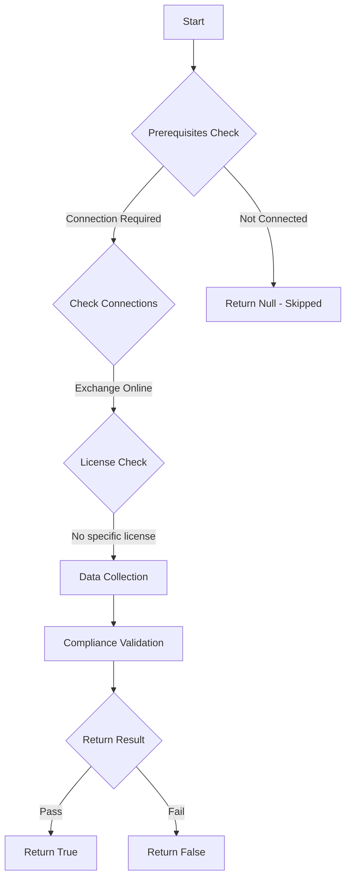

# MS.EXO: Checks state of sharing policies

## Overview

**Function Name:** `Test-MtCisaContactSharing`
**Category:** CISA/Exchange
**Test Tag:** `MS.EXO`

## Description

Contact folders SHALL NOT be shared with all domains.

## Workflow

## Phase Details

### Phase 1: Prerequisites Check

**Required Connections:**
- Exchange Online

### Phase 2: Data Collection

**Exchange Online Requests:**
- `SharingPolicy`

### Phase 3: Compliance Validation

The function validates the collected data against compliance requirements.

### Phase 4: Return Result

| Return Value | Meaning |
| --- | --- |
| `$true` | Compliant |
| `$false` | Non-Compliant |
| `$null` | Skipped (missing prerequisites, license, or error) |

## Original Documentation

Contact folders SHALL NOT be shared with all domains.

Rationale: Contact folders may contain information that should not be shared by default with all domains. Disabling sharing with all domains closes an avenue for data exfiltration while still allowing for specific legitimate use as needed.

#### Remediation action:

To restrict sharing with all domains:
1. Sign in to the **Exchange admin center**.
2. On the left-hand pane under **Organization**, select **Sharing**.
3. Select [**Individual Sharing**](https://admin.exchange.microsoft.com/#/individualsharing).
4. For all existing policies, select the policy, then select **Manage domains**.
5. For all sharing rules under all existing policies, ensure **Sharing with everyone** and **Anonymous** do not include ContactsSharing.

#### Related links

* [Exchange admin center - Individual Sharing](https://admin.exchange.microsoft.com/#/individualsharing)
* [CISA 6 Calendar and Contact Sharing - MS.EXO.6.1v1](https://github.com/cisagov/ScubaGear/blob/main/PowerShell/ScubaGear/baselines/exo.md#msexo61v1)
* [CISA ScubaGear Rego Reference](https://github.com/cisagov/ScubaGear/blob/main/PowerShell/ScubaGear/Rego/EXOConfig.rego#L335)

<!--- Results --->
%TestResult%

## Standalone Function

See the standalone compliance check function: [`Test-MtCisaContactSharingCompliance.ps1`](../../standalone-functions/CISA/Exchange/Test-MtCisaContactSharingCompliance.ps1)
