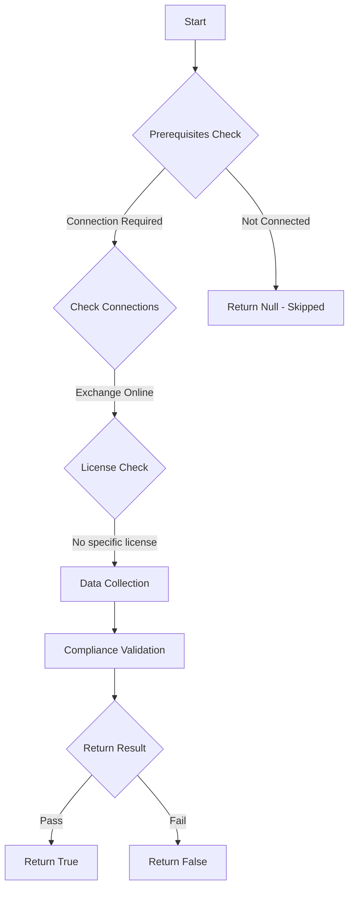

# MS.EXO: Checks state of DKIM for all EXO domains

## Overview

**Function Name:** `Test-MtCisaDkim`
**Category:** CISA/Exchange
**Test Tag:** `MS.EXO`

## Description

DKIM SHOULD be enabled for all domains.

## Workflow

## Phase Details

### Phase 1: Prerequisites Check

**Required Connections:**
- Exchange Online

### Phase 2: Data Collection

**Exchange Online Requests:**
- `DkimSigningConfig`
- `AcceptedDomain`

**Cmdlets/Functions Used:**
- `Get-MailAuthenticationRecord`

### Phase 3: Compliance Validation

**Properties Checked:**

| Property | Expected Value |
| --- | --- |
| `domain` | `$domain.domainname` |

### Phase 4: Return Result

| Return Value | Meaning |
| --- | --- |
| `$true` | Compliant |
| `$false` | Non-Compliant |
| `$null` | Skipped (missing prerequisites, license, or error) |

## Original Documentation

DKIM SHOULD be enabled for all domains.

Rationale: An adversary may modify the `FROM` field of an email such that it appears to be a legitimate email sent by an agency, facilitating phishing attacks. Enabling DKIM is another means for recipients to detect spoofed emails and verify the integrity of email content.

### Remediation action:

#### Option 1: Enable DKIM
To enable DKIM, follow the instructions listed on [Steps to Create, enable and disable DKIM from Microsoft 365 Defender portal | Microsoft Learn](https://learn.microsoft.com/en-us/microsoft-365/security/office-365-security/email-authentication-dkim-configure?view=o365-worldwide#steps-to-create-enable-and-disable-dkim-from-microsoft-365-defender-portal).

#### Option 2: Disallow mail to be sent from domain
If the domain is not used for sending mail, we recommend disabling the ability to send from this domain. This will skip the domain for this particular test.

1. Sign in to the [**Exchange Admin Center - Accepted Domains**](https://admin.exchange.microsoft.com/#/accepteddomains).
2. Select the domain to disable sending from.
3. Uncheck **Allow mail to be sent from this domain**.

We recommend doing this for **\*onmicrosoft.com** domains.

### Related links

* [Defender admin center - Email authentication settings](https://security.microsoft.com/authentication?viewid=DKIM)
* [CISA 3 Sender Policy Framework - MS.EXO.3.1v1](https://github.com/cisagov/ScubaGear/blob/main/PowerShell/ScubaGear/baselines/exo.md#msexo31v1)
* [CISA ScubaGear Rego Reference](https://github.com/cisagov/ScubaGear/blob/main/PowerShell/ScubaGear/Rego/EXOConfig.rego#L107)

<!--- Results --->
%TestResult%

## Standalone Function

See the standalone compliance check function: [`Test-MtCisaDkimCompliance.ps1`](../../standalone-functions/CISA/Exchange/Test-MtCisaDkimCompliance.ps1)
