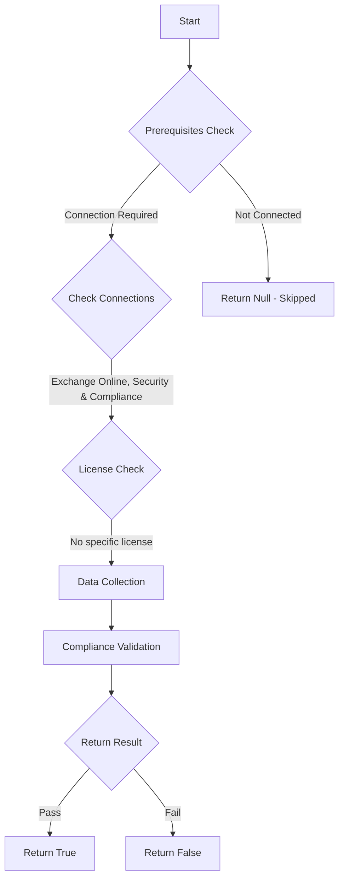

# MS.EXO: This will always return $null

## Overview

**Function Name:** `Test-MtCisaDlpAlternate`
**Category:** CISA/Exchange
**Test Tag:** `MS.EXO`

## Description

The selected DLP solution SHOULD offer services comparable to the native DLP solution offered by Microsoft.

## Workflow

## Phase Details

### Phase 1: Prerequisites Check

**Required Connections:**
- Exchange Online
- Security & Compliance

### Phase 2: Data Collection

### Phase 3: Compliance Validation

The function validates the collected data against compliance requirements.

### Phase 4: Return Result

| Return Value | Meaning |
| --- | --- |
| `$true` | Compliant |
| `$false` | Non-Compliant |
| `$null` | Skipped (missing prerequisites, license, or error) |

## Original Documentation

The selected DLP solution SHOULD offer services comparable to the native DLP solution offered by Microsoft.

Rationale: Any alternative DLP solution should be able to detect sensitive information in Exchange Online and block access to unauthorized entities.

> This test will always skip by default.

#### Related links

* [Purview admin center - Data loss prevention policies](https://purview.microsoft.com/datalossprevention/policies)
* [CISA 8 Data Loss Prevention Solutions - MS.EXO.8.3](https://github.com/cisagov/ScubaGear/blob/main/PowerShell/ScubaGear/baselines/exo.md#msexo83v1)
* [CISA ScubaGear Rego Reference](https://github.com/cisagov/ScubaGear/blob/main/PowerShell/ScubaGear/Rego/EXOConfig.rego#L453)

<!--- Results --->
%TestResult%

## Standalone Function

See the standalone compliance check function: [`Test-MtCisaDlpAlternateCompliance.ps1`](../../standalone-functions/CISA/Exchange/Test-MtCisaDlpAlternateCompliance.ps1)
