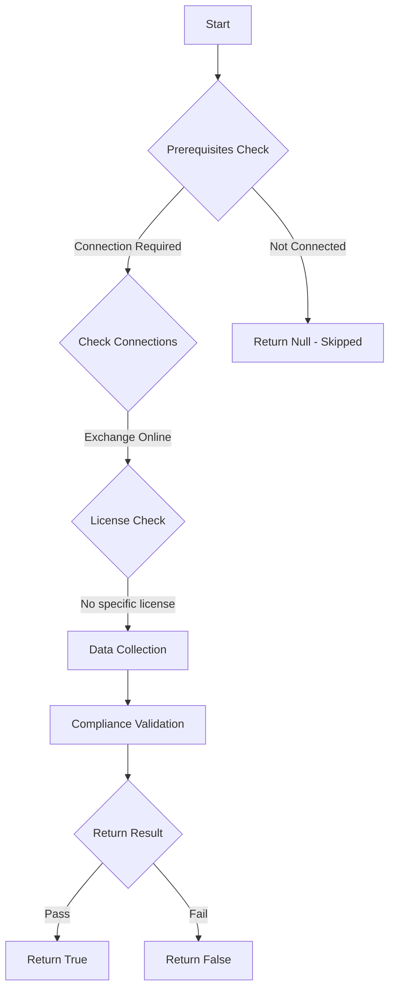

# MS.EXO: Checks state of DMARC records for all exo domains

## Overview

**Function Name:** `Test-MtCisaDmarcAggregateCisa`
**Category:** CISA/Exchange
**Test Tag:** `MS.EXO`

## Description

The DMARC point of contact for aggregate reports SHALL include reports@dmarc.cyber.dhs.gov.

## Workflow

## Phase Details

### Phase 1: Prerequisites Check

**Required Connections:**
- Exchange Online

### Phase 2: Data Collection

**Exchange Online Requests:**
- `AcceptedDomain`

**Cmdlets/Functions Used:**
- `Get-MailAuthenticationRecord`

### Phase 3: Compliance Validation

The function validates the collected data against compliance requirements.

### Phase 4: Return Result

| Return Value | Meaning |
| --- | --- |
| `$true` | Compliant |
| `$false` | Non-Compliant |
| `$null` | Skipped (missing prerequisites, license, or error) |

## Original Documentation

The DMARC point of contact for aggregate reports SHALL include `reports@dmarc.cyber.dhs.gov`.

Rationale: Email spoofing attempts are not inherently visible to domain owners. DMARC provides a mechanism to receive reports of spoofing attempts. Including reports@dmarc.cyber.dhs.gov as a point of contact for these reports gives CISA insight into spoofing attempts and is required by BOD 18-01 for FCEB departments and agencies.

**Note: Only federal, executive branch, departments and agencies should include this email address in their DMARC record.**

> For other organization's there are many services that offer managed DMARC analysis and reporting, though ensure you properly align your implementation with your organization's policies for data handling.

#### Remediation action:

* See MS.EXO.4.1v1 Instructions for an overview of how to publish and check a DMARC record.
* Ensure the record published includes reports@dmarc.cyber.dhs.gov as one of the emails for the RUA field.

#### Related links

* [Exchange admin center - Accepted domains](https://admin.exchange.microsoft.com/#/accepteddomains)
* [CISA 4 Domain-Based Message Authentication, Reporting, and Conformance (DMARC) - MS.EXO.4.3v1](https://github.com/cisagov/ScubaGear/blob/main/PowerShell/ScubaGear/baselines/exo.md#msexo43v1)
* [CISA ScubaGear Rego Reference](https://github.com/cisagov/ScubaGear/blob/main/PowerShell/ScubaGear/Rego/EXOConfig.rego#L207)

<!--- Results --->
%TestResult%

## Standalone Function

See the standalone compliance check function: [`Test-MtCisaDmarcAggregateCisaCompliance.ps1`](../../standalone-functions/CISA/Exchange/Test-MtCisaDmarcAggregateCisaCompliance.ps1)
