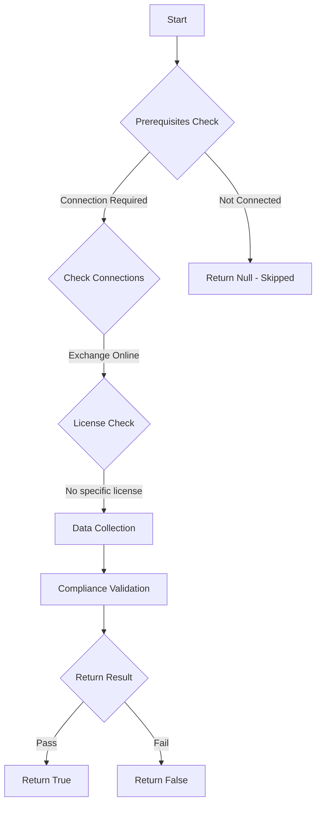

# MS.EXO: Checks state of DMARC records for all exo domains

## Overview

**Function Name:** `Test-MtCisaDmarcRecordReject`
**Category:** CISA/Exchange
**Test Tag:** `MS.EXO`

## Description

The DMARC message rejection option SHALL be p=reject.

## Workflow

## Phase Details

### Phase 1: Prerequisites Check

**Required Connections:**
- Exchange Online

### Phase 2: Data Collection

**Exchange Online Requests:**
- `AcceptedDomain`

**Cmdlets/Functions Used:**
- `Get-MailAuthenticationRecord`

### Phase 3: Compliance Validation

The function validates the collected data against compliance requirements.

### Phase 4: Return Result

| Return Value | Meaning |
| --- | --- |
| `$true` | Compliant |
| `$false` | Non-Compliant |
| `$null` | Skipped (missing prerequisites, license, or error) |

## Original Documentation

The DMARC message rejection option SHALL be p=reject.

Rationale: Of the three policy options (i.e., none, quarantine, and reject), reject provides the strongest protection. Reject is the level of protection required by BOD 18-01 for FCEB departments and agencies.

#### Remediation action:

* See MS.EXO.4.1v1 Instructions for an overview of how to publish and check a DMARC record.
* Ensure the record published includes p=reject.

#### Related links

* [Exchange admin center - Accepted domains](https://admin.exchange.microsoft.com/#/accepteddomains)
* [CISA 4 Domain-Based Message Authentication, Reporting, and Conformance (DMARC) - MS.EXO.4.2v1](https://github.com/cisagov/ScubaGear/blob/main/PowerShell/ScubaGear/baselines/exo.md#msexo42v1)
* [CISA ScubaGear Rego Reference](https://github.com/cisagov/ScubaGear/blob/main/PowerShell/ScubaGear/Rego/EXOConfig.rego#L176)

<!--- Results --->
%TestResult%

## Standalone Function

See the standalone compliance check function: [`Test-MtCisaDmarcRecordRejectCompliance.ps1`](../../standalone-functions/CISA/Exchange/Test-MtCisaDmarcRecordRejectCompliance.ps1)
