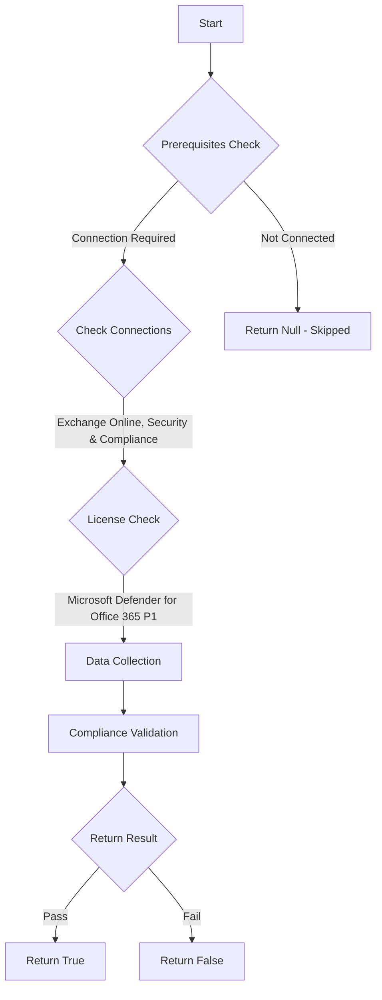

# MS.EXO: Checks state of alerts

## Overview

**Function Name:** `Test-MtCisaExoAlert`
**Category:** CISA/Exchange
**Test Tag:** `MS.EXO`

## Description

Alerts SHALL be enabled.

## Workflow

## Phase Details

### Phase 1: Prerequisites Check

**Required Connections:**
- Exchange Online
- Security & Compliance

**Required Licenses:**
- Microsoft Defender for Office 365 P1

### Phase 2: Data Collection

**Exchange Online Requests:**
- `ProtectionAlert`

### Phase 3: Compliance Validation

The function validates the collected data against compliance requirements.

### Phase 4: Return Result

| Return Value | Meaning |
| --- | --- |
| `$true` | Compliant |
| `$false` | Non-Compliant |
| `$null` | Skipped (missing prerequisites, license, or error) |

## Original Documentation

At a minimum, the following alerts SHALL be enabled:
- Suspicious email sending patterns detected.
- Suspicious Connector Activity.
- Suspicious Email Forwarding Activity.
- Messages have been delayed.
- Tenant restricted from sending unprovisioned email.
- Tenant restricted from sending email.
- A potentially malicious URL click was detected.

Rationale: Potentially malicious or service impacting events may go undetected without a means of detecting these events. Setting up a mechanism to alert administrators to events listed above draws attention to them to help minimize impact to users and the agency.

#### Remediation action:

1. Sign in to **Microsoft 365 Defender**.
2. Under **Email & collaboration**, select **Policies & rules**.
3. Select [**Alert Policy**](https://security.microsoft.com/alertpoliciesv2).
4. Select the checkbox next to each alert to enable as determined by the agency and at a minimum those referenced in the [CISA M365 Security Configuration Baseline for Exchange Online](https://github.com/cisagov/ScubaGear/blob/main/PowerShell/ScubaGear/baselines/exo.md#msexo161v1) which are:
    - Suspicious email sending patterns detected.
    - Suspicious connector activity.
    - Suspicious Email Forwarding Activity.
    - Messages have been delayed.
    - Tenant restricted from sending unprovisioned email.
    - Tenant restricted from sending email.
    - A potentially malicious URL click was detected.
5. Click the pencil icon from the top menu.
6. Select the **Enable selected policies** action from the **Bulk actions** menu.

#### Related links

* [Defender admin center - Alert policy](https://security.microsoft.com/alertpoliciesv2)
* [CISA 16 Alerts - MS.EXO.16.1](https://github.com/cisagov/ScubaGear/blob/main/PowerShell/ScubaGear/baselines/exo.md#msexo161v1)
* [CISA ScubaGear Rego Reference](https://github.com/cisagov/ScubaGear/blob/main/PowerShell/ScubaGear/Rego/EXOConfig.rego#L863)

<!--- Results --->
%TestResult%

## Standalone Function

See the standalone compliance check function: [`Test-MtCisaExoAlertCompliance.ps1`](../../standalone-functions/CISA/Exchange/Test-MtCisaExoAlertCompliance.ps1)
