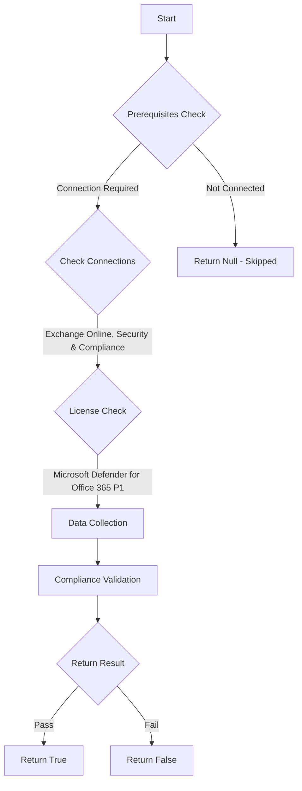

# MS.EXO: Checks state of alerts

## Overview

**Function Name:** `Test-MtCisaExoAlertSiem`
**Category:** CISA/Exchange
**Test Tag:** `MS.EXO`

## Description

Alerts SHOULD be sent to a monitored address or incorporated into a security information and event management (SIEM) system.

## Workflow

## Phase Details

### Phase 1: Prerequisites Check

**Required Connections:**
- Exchange Online
- Security & Compliance

**Required Licenses:**
- Microsoft Defender for Office 365 P1

### Phase 2: Data Collection

### Phase 3: Compliance Validation

The function validates the collected data against compliance requirements.

### Phase 4: Return Result

| Return Value | Meaning |
| --- | --- |
| `$true` | Compliant |
| `$false` | Non-Compliant |
| `$null` | Skipped (missing prerequisites, license, or error) |

## Original Documentation

Alerts SHOULD be sent to a monitored address or incorporated into a security information and event management (SIEM) system.

Rationale: Suspicious or malicious events, if not resolved promptly, may have a greater impact to users and the agency. Sending alerts to a monitored email address or SIEM system helps ensure these suspicious or malicious events are acted upon in a timely manner to limit overall impact.

#### Remediation action:

1. Sign in to **Microsoft 365 Defender**.
2. Select [**Settings**](https://security.microsoft.com/securitysettings).
3. Select either:
    - [**Microsoft Sentinel**](https://security.microsoft.com/sentinel/settings).
    - **Defender XDR**, and under **General**, select [**Streaming API**](https://security.microsoft.com/securitysettings/defender/raw_data_export).
4. Ensure a SIEM integration is configured for your organization.

#### Related links

* [Defender admin center - Alert policy](https://security.microsoft.com/alertpoliciesv2)
* [Defender admin center - Streaming API](https://security.microsoft.com/securitysettings/defender/raw_data_export)
* [Defender admin center - Sentinel workspaces](https://security.microsoft.com/sentinel/settings)
* [CISA 16 Alerts - MS.EXO.16.2](https://github.com/cisagov/ScubaGear/blob/main/PowerShell/ScubaGear/baselines/exo.md#msexo162v1)
* [CISA ScubaGear Rego Reference](https://github.com/cisagov/ScubaGear/blob/main/PowerShell/ScubaGear/Rego/EXOConfig.rego#L878)

<!--- Results --->
%TestResult%

## Standalone Function

See the standalone compliance check function: [`Test-MtCisaExoAlertSiemCompliance.ps1`](../../standalone-functions/CISA/Exchange/Test-MtCisaExoAlertSiemCompliance.ps1)
