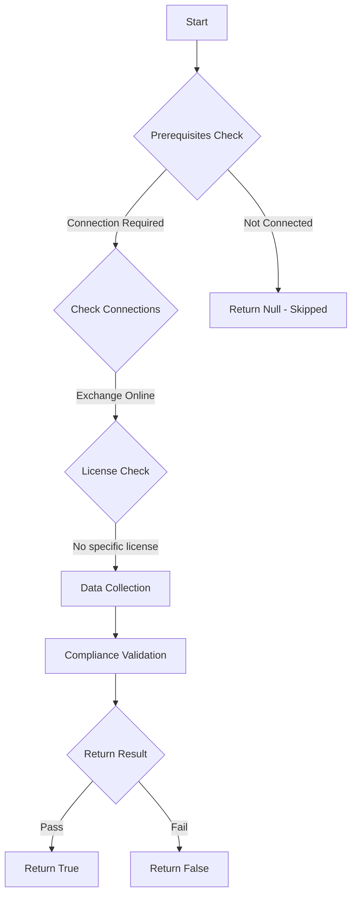

# MS.EXO: Checks state of transport policies

## Overview

**Function Name:** `Test-MtCisaExternalSenderWarning`
**Category:** CISA/Exchange
**Test Tag:** `MS.EXO`

## Description

External sender warnings SHALL be implemented.

## Workflow



## Phase Details

### Phase 1: Prerequisites Check

**Required Connections:**
- Exchange Online

### Phase 2: Data Collection

**Exchange Online Requests:**
- `TransportRule`

**Cmdlets/Functions Used:**
- `Get-ExternalInOutlook`

### Phase 3: Compliance Validation

**Properties Checked:**

| Property | Expected Value |
| --- | --- |
| `Mode` | `Enforce` |
| `FromScope` | `NotInOrganization` |
| `SenderAddressLocation` | `Header` |

### Phase 4: Return Result

| Return Value | Meaning |
| --- | --- |
| `$true` | Compliant |
| `$false` | Non-Compliant |
| `$null` | Skipped (missing prerequisites, license, or error) |

## Original Documentation

External sender warnings SHALL be implemented.

Rationale: Phishing is an ever-present threat. Alerting users when email originates from outside their organization can encourage them to exercise increased caution, especially if an email is one they expected from an internal sender.

> ⚠️ WARNING: This test allows the use of a technical mechanism that differs from CISA's, though the outcome is the same.

#### Remediation action:

##### Option 1: Use external sender identification

This feature is only available for Outlook, Outlook for Mac, Outlook on the web, and Outlook for iOS and Android.

1. Connect to Exchange Online using PowerShell module `ExchangeOnlineManagement`
2. Enable the feature with the cmdlet `Set-ExternalInOutlook`

```powershell
Install-Module -Name ExchangeOnlineManagement
Connect-ExchangeOnline
Set-ExternalInOutlook -Enabled $true
```

##### Option 2: Prepend subject with "[External]"

To create a mail flow rule to produce external sender warnings:
1. Sign in to the **Exchange admin center**.
2. Under **Mail flow**, select [**Rules**](https://admin.exchange.microsoft.com/#/transportrules).
3. Click the plus (+) button to create a new rule.
4. Select **Modify messages…**.
5. Give the rule an appropriate name.
6. Under **Apply this rule if…**, select **The sender is external/internal**.
7. Under **select sender location**, select **Outside the organization**, then click **OK**.
8. Under **Do the following…**, select **Prepend the subject of the message with…**.
9. Under **specify subject prefix**, enter a message such as "[External]" (without the quotation marks), then click **OK**.
10. Click **Next**.
11. Under **Choose a mode for this rule**, select **Enforce**.
12. Leave the **Severity** as **Not Specified**.
13. Leave the **Match sender address in message** as **Header** and click **Next**.
14. Click **Finish** and then **Done**.
15. The new rule will be disabled. Re-select the new rule to show its settings and slide the **Enable or disable rule** slider to the right until it shows as **Enabled**.

#### Related links

* [Exchange admin center - Mail Flow Rules](https://admin.exchange.microsoft.com/#/transportrules)
* [CISA 7 External Sender Warnings - MS.EXO.7.1v1](https://github.com/cisagov/ScubaGear/blob/main/PowerShell/ScubaGear/baselines/exo.md#msexo71v1)
* [CISA ScubaGear Rego Reference](https://github.com/cisagov/ScubaGear/blob/main/PowerShell/ScubaGear/Rego/EXOConfig.rego#L405)

<!--- Results --->
%TestResult%

## Standalone Function

See the standalone compliance check function: [`Test-MtCisaExternalSenderWarningCompliance.ps1`](../../standalone-functions/CISA/Exchange/Test-MtCisaExternalSenderWarningCompliance.ps1)
