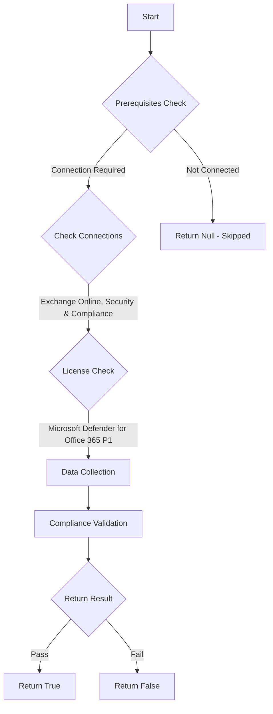

# MS.EXO: Checks state of preset security policies

## Overview

**Function Name:** `Test-MtCisaImpersonation`
**Category:** CISA/Exchange
**Test Tag:** `MS.EXO`

## Description

Impersonation protection checks SHOULD be used.

## Workflow

## Phase Details

### Phase 1: Prerequisites Check

**Required Connections:**
- Exchange Online
- Security & Compliance

**Required Licenses:**
- Microsoft Defender for Office 365 P1

### Phase 2: Data Collection

**Exchange Online Requests:**
- `AntiPhishPolicy`

### Phase 3: Compliance Validation

**Properties Checked:**

| Property | Expected Value |
| --- | --- |
| `ImpersonationProtectionState` | `Automatic` |
| `RecommendedPolicyType` | `Standard` |
| `RecommendedPolicyType` | `Strict` |

### Phase 4: Return Result

| Return Value | Meaning |
| --- | --- |
| `$true` | Compliant |
| `$false` | Non-Compliant |
| `$null` | Skipped (missing prerequisites, license, or error) |

## Original Documentation

Impersonation protection checks SHOULD be used.

Rationale: Users might not be able to reliably identify phishing emails, especially if the `FROM` address is nearly indistinguishable from that of a known entity. By automatically identifying senders who appear to be impersonating known senders, the risk of a successful phishing attempt can be reduced.

#### Remediation action:

1. Sign in to **Microsoft 365 Defender**.
2. In the left-hand menu, go to **Email & Collaboration** > **Policies & Rules**.
3. Select **Threat Policies**.
4. From the **Templated policies** section, select **Preset Security Policies**.
5. Under **Standard protection**, slide the toggle switch to the right so the text next to the toggle reads **Standard protection is on**.
6. Under **Strict protection**, slide the toggle switch to the right so the text next to the toggle reads **Strict protection is on**.

Note: If the toggle slider in step 5 is grayed out, click on **Manage protection settings** instead and configure the policy settings according to [Use the Microsoft 365 Defender portal to assign Standard and Strict preset security policies to users | Microsoft Learn](https://learn.microsoft.com/en-us/microsoft-365/security/office-365-security/preset-security-policies?view=o365-worldwide#use-the-microsoft-365-defender-portal-to-assign-standard-and-strict-preset-security-policies-to-users).

#### Related links

* [Defender admin center - Preset security policies](https://security.microsoft.com/presetSecurityPolicies)
* [CISA 11 Phishing Protections - MS.EXO.11.1v1](https://github.com/cisagov/ScubaGear/blob/main/PowerShell/ScubaGear/baselines/exo.md#msexo111v1)
* [CISA ScubaGear Rego Reference](https://github.com/cisagov/ScubaGear/blob/main/PowerShell/ScubaGear/Rego/EXOConfig.rego#L617)
* [Microsoft Learn - Impersonation settings in anti-phishing policies in Microsoft Defender for Office 365](https://learn.microsoft.com/en-us/defender-office-365/anti-phishing-policies-about#impersonation-settings-in-anti-phishing-policies-in-microsoft-defender-for-office-365)

<!--- Results --->
%TestResult%

## Standalone Function

See the standalone compliance check function: [`Test-MtCisaImpersonationCompliance.ps1`](../../standalone-functions/CISA/Exchange/Test-MtCisaImpersonationCompliance.ps1)
