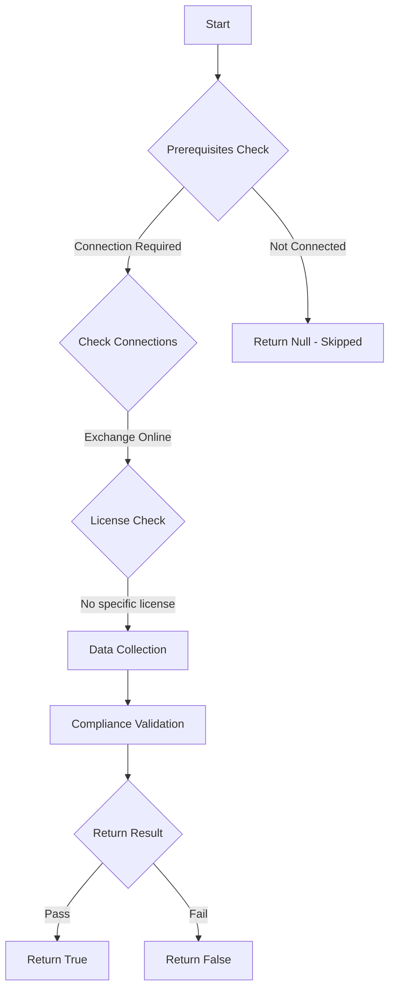

# MS.EXO: Checks state of mailbox auditing

## Overview

**Function Name:** `Test-MtCisaMailboxAuditing`
**Category:** CISA/Exchange
**Test Tag:** `MS.EXO`

## Description

Mailbox auditing SHALL be enabled.

## Workflow

## Phase Details

### Phase 1: Prerequisites Check

**Required Connections:**
- Exchange Online

### Phase 2: Data Collection

**Exchange Online Requests:**
- `OrganizationConfig`

### Phase 3: Compliance Validation

The function validates the collected data against compliance requirements.

### Phase 4: Return Result

| Return Value | Meaning |
| --- | --- |
| `$true` | Compliant |
| `$false` | Non-Compliant |
| `$null` | Skipped (missing prerequisites, license, or error) |

## Original Documentation

Mailbox auditing SHALL be enabled.

Rationale: Exchange Online user accounts can be compromised or misused. Enabling mailbox auditing provides a valuable source of information to detect and respond to mailbox misuse.

#### Remediation action:

Mailbox auditing can be managed from the [Exchange Online PowerShell module](https://learn.microsoft.com/en-us/microsoft-365/compliance/audit-mailboxes?view=o365-worldwide). Follow the instructions listed on Manage mailbox auditing in Office 365.
1. To enable mailbox auditing by default for your organization via PowerShell:
2. Connect to the Exchange Online PowerShell.
3. Run the following command:
    `Set-OrganizationConfig –AuditDisabled $false`

#### Related links

* [Microsoft Learn - Mailbox Auditing](https://learn.microsoft.com/en-us/microsoft-365/compliance/audit-mailboxes?view=o365-worldwide)
* [CISA 13 Mailbox Auditing - MS.EXO.13.1v1](https://github.com/cisagov/ScubaGear/blob/main/PowerShell/ScubaGear/baselines/exo.md#msexo131v1)
* [CISA ScubaGear Rego Reference](https://github.com/cisagov/ScubaGear/blob/main/PowerShell/ScubaGear/Rego/EXOConfig.rego#L741)

<!--- Results --->
%TestResult%

## Standalone Function

See the standalone compliance check function: [`Test-MtCisaMailboxAuditingCompliance.ps1`](../../standalone-functions/CISA/Exchange/Test-MtCisaMailboxAuditingCompliance.ps1)
