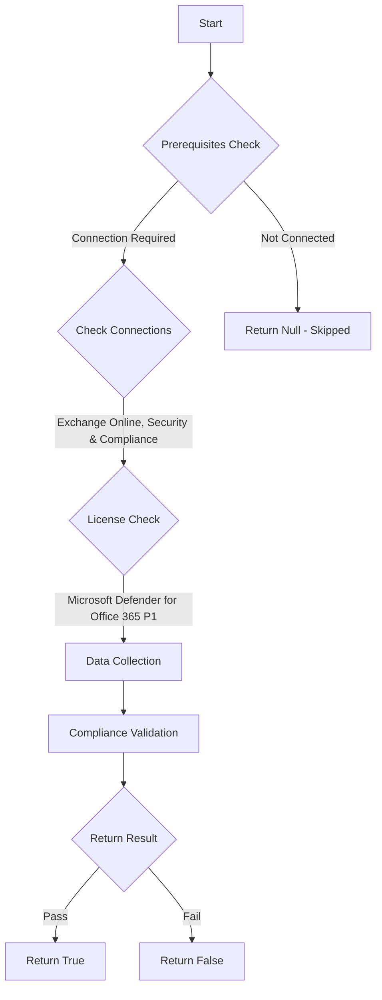

# MS.EXO: Checks state of URL block list

## Overview

**Function Name:** `Test-MtCisaSafeLink`
**Category:** CISA/Exchange
**Test Tag:** `MS.EXO`

## Description

URL comparison with a block-list SHOULD be enabled.

## Workflow

## Phase Details

### Phase 1: Prerequisites Check

**Required Connections:**
- Exchange Online
- Security & Compliance

**Required Licenses:**
- Microsoft Defender for Office 365 P1

### Phase 2: Data Collection

**Exchange Online Requests:**
- `SafeLinksPolicy`

### Phase 3: Compliance Validation

**Properties Checked:**

| Property | Expected Value |
| --- | --- |
| `RecommendedPolicyType` | `Standard` |
| `RecommendedPolicyType` | `Strict` |

### Phase 4: Return Result

| Return Value | Meaning |
| --- | --- |
| `$true` | Compliant |
| `$false` | Non-Compliant |
| `$null` | Skipped (missing prerequisites, license, or error) |

## Original Documentation

URL comparison with a block-list SHOULD be enabled.

Rationale: Users may be directed to malicious websites via links in email. Blocking access to known, malicious URLs can prevent users from accessing known malicious websites.

#### Remediation action:

1. Sign in to **Microsoft 365 Defender**.
2. In the left-hand menu, go to **Email & Collaboration** > **Policies & Rules**.
3. Select **Threat Policies**.
4. From the **Templated policies** section, select **Preset Security Policies**.
5. Under either **Standard protection** or **Strict protection**, select **Manage protection settings**.
6. Select **Next** until you reach the **Apply Defender for Office 365 protection** page.
7. On the **Apply Defender for Office 365 protection** page, select **All recipients**.
8. (Optional) Under **Exclude these recipients**, add **Users** and **Groups** to be exempted from the preset policies.
9. Select **Next** on each page until the **Review and confirm your changes** page.
10. On the **Review and confirm your changes** page, select **Confirm**.

#### Related links

* [Defender admin center - Preset security policies](https://security.microsoft.com/presetSecurityPolicies)
* [CISA 15 Link Protection - MS.EXO.15.1](https://github.com/cisagov/ScubaGear/blob/main/PowerShell/ScubaGear/baselines/exo.md#msexo151v1)
* [CISA ScubaGear Rego Reference](https://github.com/cisagov/ScubaGear/blob/main/PowerShell/ScubaGear/Rego/EXOConfig.rego#L813)

<!--- Results --->
%TestResult%

## Standalone Function

See the standalone compliance check function: [`Test-MtCisaSafeLinkCompliance.ps1`](../../standalone-functions/CISA/Exchange/Test-MtCisaSafeLinkCompliance.ps1)
