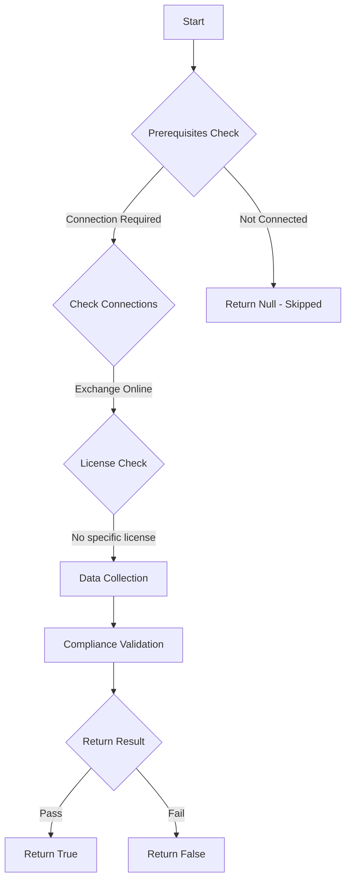

# MS.EXO: Checks state of SMTP authentication in Exchange Online.

## Overview

**Function Name:** `Test-MtCisaSmtpAuthentication`
**Category:** CISA/Exchange
**Test Tag:** `MS.EXO`

## Description

SMTP authentication SHALL be disabled.

## Workflow

## Phase Details

### Phase 1: Prerequisites Check

**Required Connections:**
- Exchange Online

### Phase 2: Data Collection

**Exchange Online Requests:**
- `TransportConfig`

### Phase 3: Compliance Validation

The function validates the collected data against compliance requirements.

### Phase 4: Return Result

| Return Value | Meaning |
| --- | --- |
| `$true` | Compliant |
| `$false` | Non-Compliant |
| `$null` | Skipped (missing prerequisites, license, or error) |

## Original Documentation

SMTP AUTH SHALL be disabled.

Rationale: SMTP AUTH is not used or needed by modern email clients. Therefore, disabling it as the global default conforms to the principle of least functionality.

#### Remediation action:

1. To disable SMTP AUTH for the organization:
2. Sign in to the **Exchange admin center**.
3. On the left hand pane, select [**Settings**](https://admin.exchange.microsoft.com/#/settings); then from the settings list, select **Mail Flow**.
4. Make sure the setting **Turn off SMTP AUTH protocol for your organization** is checked.

#### Related links

* [Exchange admin center - Settings](https://admin.exchange.microsoft.com/#/settings)
* [CISA 5 Simple Mail Transfer Protocol Authentication - MS.EXO.5.1v1](https://github.com/cisagov/ScubaGear/blob/main/PowerShell/ScubaGear/baselines/exo.md#msexo51v1)
* [CISA ScubaGear Rego Reference](https://github.com/cisagov/ScubaGear/blob/main/PowerShell/ScubaGear/Rego/EXOConfig.rego#L306)

<!--- Results --->
%TestResult%

## Standalone Function

See the standalone compliance check function: [`Test-MtCisaSmtpAuthenticationCompliance.ps1`](../../standalone-functions/CISA/Exchange/Test-MtCisaSmtpAuthenticationCompliance.ps1)
