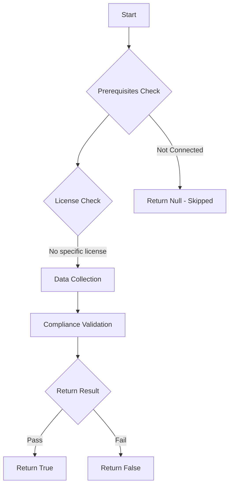

# MS.EXO: Checks state of SPF records for all exo domains

## Overview

**Function Name:** `Test-MtCisaSpfRestriction`
**Category:** CISA/Exchange
**Test Tag:** `MS.EXO`

## Description

A list of approved IP addresses for sending mail SHALL be maintained.

## Workflow

## Phase Details

### Phase 1: Prerequisites Check

No specific prerequisites required.

### Phase 2: Data Collection

### Phase 3: Compliance Validation

The function validates the collected data against compliance requirements.

### Phase 4: Return Result

| Return Value | Meaning |
| --- | --- |
| `$true` | Compliant |
| `$false` | Non-Compliant |
| `$null` | Skipped (missing prerequisites, license, or error) |

## Original Documentation

**This test is deprecated by CISA as of May 2024 and will always be skipped. The content below is retained as a historical archive and will be removed in a future version.**

MS.EXO.2.1v1 was removed because it is not a security configuration that can be audited; it acts as an implementation step for MS.EXO.2.2. Maintaining the list of approved IP addresses has been incorporated into the implementation guidance for MS.EXO.2.2 and removed as a standalone policy. See [CISA SCuBA Removed Policies — MS.EXO.2.1v1](https://github.com/cisagov/ScubaGear/blob/main/PowerShell/ScubaGear/baselines/removedpolicies.md#msexo21v1).

A list of approved IP addresses for sending mail SHALL be maintained.

Rationale: Failing to maintain an accurate list of authorized IP addresses may result in spoofed email messages or failure to deliver legitimate messages when SPF is enabled. Maintaining such a list helps ensure that unauthorized servers sending spoofed messages can be detected, and permits message delivery from legitimate senders.

#### Remediation action:

* Identify any approved senders specific to your agency.
* Perform regular review of SPF record and update as necessary.
* Additionally, see [External DNS records required for SPF](https://learn.microsoft.com/en-us/microsoft-365/enterprise/external-domain-name-system-records?view=o365-worldwide#external-dns-records-required-for-spf) for inclusions required for Microsoft to send email on behalf of your domain.

#### Related links

* [Exchange admin center - Accepted domains](https://admin.exchange.microsoft.com/#/accepteddomains)
* [CISA 2 Sender Policy Framework - MS.EXO.2.1v1](https://github.com/cisagov/ScubaGear/blob/main/PowerShell/ScubaGear/baselines/exo.md#msexo21v1)
* [CISA ScubaGear Rego Reference](https://github.com/cisagov/ScubaGear/blob/main/PowerShell/ScubaGear/Rego/EXOConfig.rego#L58)

<!--- Results --->
%TestResult%

## Standalone Function

See the standalone compliance check function: [`Test-MtCisaSpfRestrictionCompliance.ps1`](../../standalone-functions/CISA/Exchange/Test-MtCisaSpfRestrictionCompliance.ps1)
