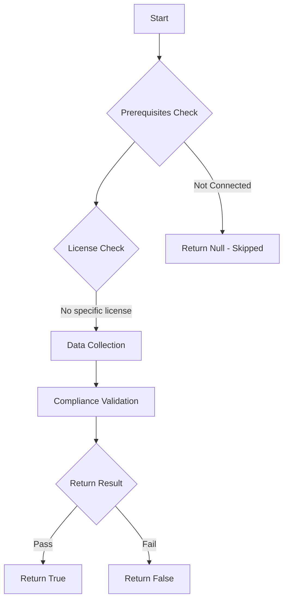

# MS.SHAREPOINT: Checks state of SharePoint Online sharing

## Overview

**Function Name:** `Test-MtCisaSpoSharing`
**Category:** CISA/SPO
**Test Tag:** `MS.SHAREPOINT`

## Description

External sharing for SharePoint SHALL be limited to Existing guests or Only People in your organization.

## Workflow

## Phase Details

### Phase 1: Prerequisites Check

No specific prerequisites required.

### Phase 2: Data Collection

**Graph API Calls:**
- `admin/sharepoint/settings`

**Cmdlets/Functions Used:**
- `Invoke-MtGraphRequest`

### Phase 3: Compliance Validation

The function validates the collected data against compliance requirements.

### Phase 4: Return Result

| Return Value | Meaning |
| --- | --- |
| `$true` | Compliant |
| `$false` | Non-Compliant |
| `$null` | Skipped (missing prerequisites, license, or error) |

## Original Documentation

External sharing for SharePoint SHALL be limited to Existing guests or Only People in your organization.

Rationale: Sharing information outside the organization via SharePoint increases the risk of unauthorized access. By limiting external sharing, administrators decrease the risk of access to information.

#### Remediation action:

1. Sign in to the [SharePoint admin center](https://go.microsoft.com/fwlink/?linkid=2185219).
2. Select Policies > Sharing.
3. Adjust external sharing slider for SharePoint to Existing guests or Only people in your organization.

> ⚠️ WARNING: This will break existing sharing.

4. Select Save.

#### Related links

* [CISA 1 External Sharing - MS.SHAREPOINT.1.1v1](https://github.com/cisagov/ScubaGear/blob/main/PowerShell/ScubaGear/baselines/sharepoint.md#mssharepoint11v1)
* [CISA ScubaGear Rego Reference](https://github.com/cisagov/ScubaGear/blob/main/PowerShell/ScubaGear/Rego/SharepointConfig.rego#L68)

<!--- Results --->
%TestResult%

## Standalone Function

See the standalone compliance check function: [`Test-MtCisaSpoSharingCompliance.ps1`](../../standalone-functions/CISA/SPO/Test-MtCisaSpoSharingCompliance.ps1)
