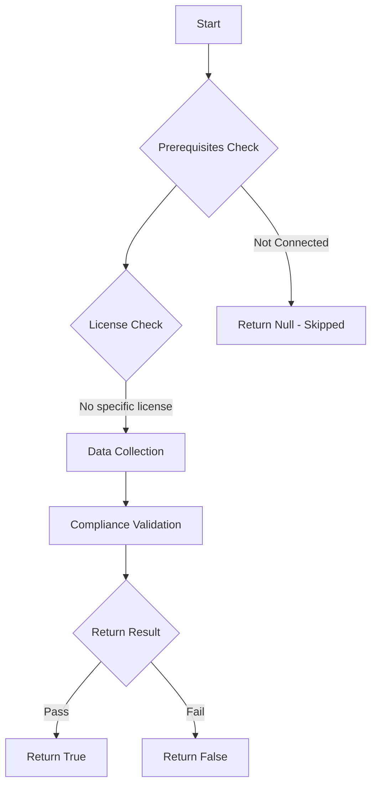

# MS.SHAREPOINT: Checks state of SharePoint Online sharing

## Overview

**Function Name:** `Test-MtCisaSpoSharingAllowedDomain`
**Category:** CISA/SPO
**Test Tag:** `MS.SHAREPOINT`

## Description

External sharing SHALL be restricted to approved external domains and/or users in approved security groups per interagency collaboration needs.

## Workflow

## Phase Details

### Phase 1: Prerequisites Check

No specific prerequisites required.

### Phase 2: Data Collection

**Graph API Calls:**
- `admin/sharepoint/settings`

**Cmdlets/Functions Used:**
- `Invoke-MtGraphRequest`

### Phase 3: Compliance Validation

The function validates the collected data against compliance requirements.

### Phase 4: Return Result

| Return Value | Meaning |
| --- | --- |
| `$true` | Compliant |
| `$false` | Non-Compliant |
| `$null` | Skipped (missing prerequisites, license, or error) |

## Original Documentation

External sharing SHALL be restricted to approved external domains and/or users in approved security groups per interagency collaboration needs.

Rationale: By limiting sharing to domains or approved security groups used for interagency collaboration purposes, administrators help prevent sharing with unknown organizations and individuals.

#### Remediation action:

This policy is only applicable if the external sharing slider on the admin page is set to any value other than Only People in your organization.
1. Sign in to the [SharePoint admin center](https://go.microsoft.com/fwlink/?linkid=2185219).
2. Select Policies > Sharing.
3. Expand More external sharing settings.
4. Select Limit external sharing by domain.
5. Select Add domains.
6. Add each approved external domain users are allowed to share files with.
7. Select Manage security groups
8. Add each approved security group. Members of these groups will be allowed to share files externally.
9. Select Save.

#### Related links

* [CISA 1 External Sharing - MS.SHAREPOINT.1.3v1](https://github.com/cisagov/ScubaGear/blob/main/PowerShell/ScubaGear/baselines/sharepoint.md#mssharepoint13v1)
* [CISA ScubaGear Rego Reference](https://github.com/cisagov/ScubaGear/blob/main/PowerShell/ScubaGear/Rego/SharepointConfig.rego#L130)

<!--- Results --->
%TestResult%

## Standalone Function

See the standalone compliance check function: [`Test-MtCisaSpoSharingAllowedDomainCompliance.ps1`](../../standalone-functions/CISA/SPO/Test-MtCisaSpoSharingAllowedDomainCompliance.ps1)
