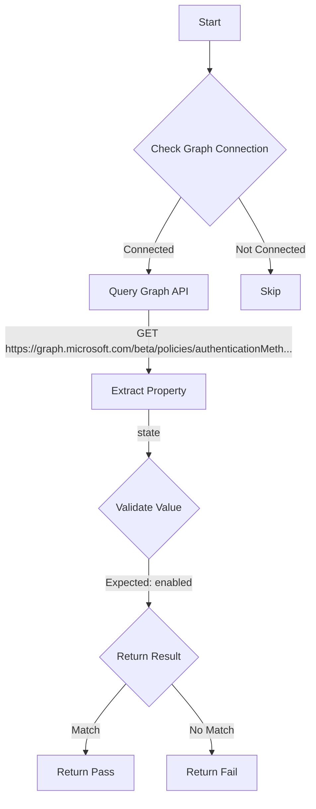

# EIDSCA.AM01: Authentication Method - Microsoft Authenticator - State

## Overview

**Check ID:** `AM01`
**Tag:** `EIDSCA.AM01`
**Category:** EIDSCA (Entra ID Security Configuration Analyzer)

## Description

EIDSCA.AM01: Authentication Method - Microsoft Authenticator - State. See https://maester.dev/docs/tests/EIDSCA.AM01

## Workflow

## Phase Details

### Phase 1: Prerequisites
- Microsoft Graph connection required

### Phase 2: Data Collection
- **API Endpoint:** `https://graph.microsoft.com/beta/policies/authenticationMethodsPolicy/authenticationMethodConfigurations('MicrosoftAuthenticator')`
- **Property Path:** `state`

### Phase 3: Compliance Validation

| Property | Comparison | Expected Value |
| --- | --- | --- |
| `state` | `-Be` | `enabled` |

### Phase 4: Return Result

| Return Value | Meaning |
| --- | --- |
| `$true` | Compliant - Configuration matches expected value |
| `$false` | Non-Compliant - Configuration does not match |
| `$null` | Skipped - Not connected or prerequisite not met |

## Standalone Function

See: [`Test-EidscaAM01Compliance.ps1`](../../standalone-functions/EIDSCA/Test-EidscaAM01Compliance.ps1)