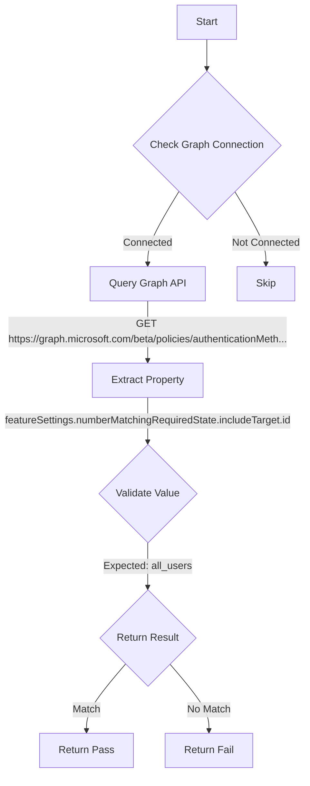

# EIDSCA.AM04: Authentication Method - Microsoft Authenticator - Included users/groups of number matching for push notifications

## Overview

**Check ID:** `AM04`
**Tag:** `EIDSCA.AM04`
**Category:** EIDSCA (Entra ID Security Configuration Analyzer)

## Description

EIDSCA.AM04: Authentication Method - Microsoft Authenticator - Included users/groups of number matching for push notifications. See https://maester.dev/docs/tests/EIDSCA.AM04

## Workflow

## Phase Details

### Phase 1: Prerequisites
- Microsoft Graph connection required

### Phase 2: Data Collection
- **API Endpoint:** `https://graph.microsoft.com/beta/policies/authenticationMethodsPolicy/authenticationMethodConfigurations('MicrosoftAuthenticator')`
- **Property Path:** `featureSettings.numberMatchingRequiredState.includeTarget.id`

### Phase 3: Compliance Validation

| Property | Comparison | Expected Value |
| --- | --- | --- |
| `featureSettings.numberMatchingRequiredState.includeTarget.id` | `-Be` | `all_users` |

### Phase 4: Return Result

| Return Value | Meaning |
| --- | --- |
| `$true` | Compliant - Configuration matches expected value |
| `$false` | Non-Compliant - Configuration does not match |
| `$null` | Skipped - Not connected or prerequisite not met |

## Standalone Function

See: [`Test-EidscaAM04Compliance.ps1`](../../standalone-functions/EIDSCA/Test-EidscaAM04Compliance.ps1)