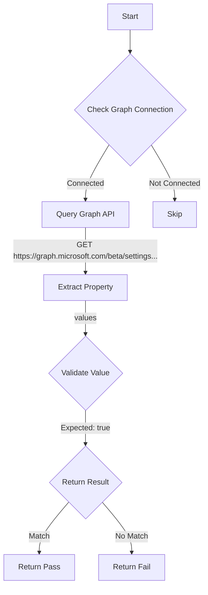

# EIDSCA.CP03: Default Settings - Consent Policy Settings - Block user consent for risky apps

## Overview

**Check ID:** `CP03`
**Tag:** `EIDSCA.CP03`
**Category:** EIDSCA (Entra ID Security Configuration Analyzer)

## Description

EIDSCA.CP03: Default Settings - Consent Policy Settings - Block user consent for risky apps. See https://maester.dev/docs/tests/EIDSCA.CP03

## Workflow

## Phase Details

### Phase 1: Prerequisites
- Microsoft Graph connection required

### Phase 2: Data Collection
- **API Endpoint:** `https://graph.microsoft.com/beta/settings`
- **Property Path:** `values`

### Phase 3: Compliance Validation

| Property | Comparison | Expected Value |
| --- | --- | --- |
| `values` | `-Be` | `true` |

### Phase 4: Return Result

| Return Value | Meaning |
| --- | --- |
| `$true` | Compliant - Configuration matches expected value |
| `$false` | Non-Compliant - Configuration does not match |
| `$null` | Skipped - Not connected or prerequisite not met |

## Standalone Function

See: [`Test-EidscaCP03Compliance.ps1`](../../standalone-functions/EIDSCA/Test-EidscaCP03Compliance.ps1)