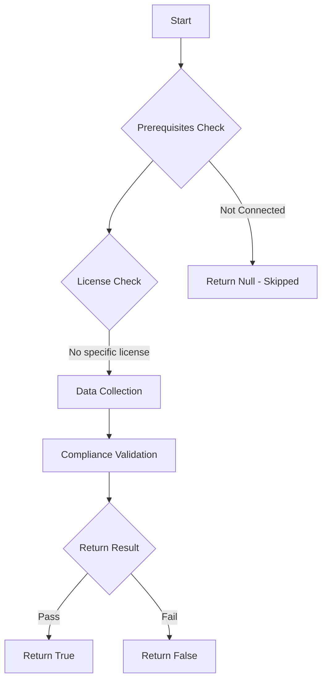

# Test-MtAIAgentAuthorAuthentication: Tests if AI agents use author (maker) authentication for their connector tools.

## Overview

**Function Name:** `Test-MtAIAgentAuthorAuthentication`
**Category:** Maester/AIAgent

## Description

Checks all Copilot Studio agents for connector tools that use author (maker)
    authentication instead of end-user authentication. When a connection uses
    author authentication, the agent accesses external services (SharePoint, SQL,
    etc.) using the bot maker's stored credentials rather than requiring the end
    user to authenticate. This creates a privilege escalation risk — the agent
    operates with the maker's permissions regardless of who is chatting with it.

    Reference: https://www.microsoft.com/en-us/security/blog/2026/02/12/copilot-studio-agent-security-top-10-risks-detect-prevent/

## Workflow

## Phase Details

### Phase 1: Prerequisites Check

No specific prerequisites required.

### Phase 2: Data Collection

**Cmdlets/Functions Used:**
- `Get-MtAIAgentInfo`

### Phase 3: Compliance Validation

The function validates the collected data against compliance requirements.

### Phase 4: Return Result

| Return Value | Meaning |
| --- | --- |
| `$true` | Compliant |
| `$false` | Non-Compliant |
| `$null` | Skipped (missing prerequisites, license, or error) |

## Original Documentation

AI agents should not use author (maker) authentication for their connector tools.

When a connector tool uses **author authentication**, the agent accesses external services (SharePoint, SQL, Outlook, etc.) using the authors stored credentials instead of requiring the end user to authenticate. This creates a **privilege escalation** risk — the agent operates with the maker's full permissions regardless of who is chatting with it, and it bypasses separation of duties controls.

### How to fix

In Copilot Studio, review the agent's tools and change each connector's authentication setting from **Agent author authentication** to **User authentication**. This ensures the agent accesses external services using the chatting user's own credentials and permission scope.

Learn more: [Configure user authentication in Copilot Studio](https://learn.microsoft.com/en-us/microsoft-copilot-studio/configure-enduser-authentication)

<!--- Results --->
%TestResult%

## Standalone Function

See the standalone compliance check function: [`Test-MtAIAgentAuthorAuthenticationCompliance.ps1`](../../standalone-functions/Maester/AIAgent/Test-MtAIAgentAuthorAuthenticationCompliance.ps1)
