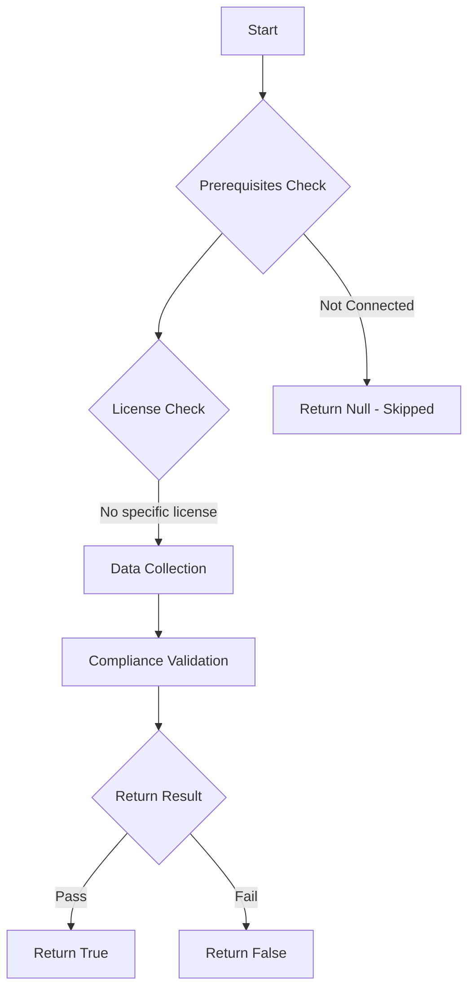

# Test-MtAIAgentBroadSharing: Tests if AI agents are shared too broadly.

## Overview

**Function Name:** `Test-MtAIAgentBroadSharing`
**Category:** Maester/AIAgent

## Description

Checks all Copilot Studio agents for those with access control set to "Any" or
    "Any multitenant", which allows any user (or users across tenants) to interact
    with the agent.

## Workflow

## Phase Details

### Phase 1: Prerequisites Check

No specific prerequisites required.

### Phase 2: Data Collection

**Cmdlets/Functions Used:**
- `Get-MtAIAgentInfo`

### Phase 3: Compliance Validation

**Properties Checked:**

| Property | Expected Value |
| --- | --- |
| `AccessControlPolicy` | `Any` |

### Phase 4: Return Result

| Return Value | Meaning |
| --- | --- |
| `$true` | Compliant |
| `$false` | Non-Compliant |
| `$null` | Skipped (missing prerequisites, license, or error) |

## Original Documentation

AI agents should not be shared broadly with unrestricted access.

Agents with access control set to **Any** or **Any multitenant** can be accessed by anyone, including users outside your organization. This increases the risk of data exposure and unauthorized use of connected systems.

### How to fix

In Copilot Studio, go the agents overview and click on the three dots (`...`) and "share". From here, select "My organization" and make sure it's set to **No permissions, unless specified**. Then, in the specific agents settings, go to "Security" and "Authentication" and make sure "Multi-tenant support" is toggled **off**.

Learn more: [Control how agents are shared](https://learn.microsoft.com/microsoft-copilot-studio/admin-sharing-controls-limits) and [share agents with other users](https://learn.microsoft.com/microsoft-copilot-studio/admin-share-bots?tabs=web)

<!--- Results --->
%TestResult%

## Standalone Function

See the standalone compliance check function: [`Test-MtAIAgentBroadSharingCompliance.ps1`](../../standalone-functions/Maester/AIAgent/Test-MtAIAgentBroadSharingCompliance.ps1)
