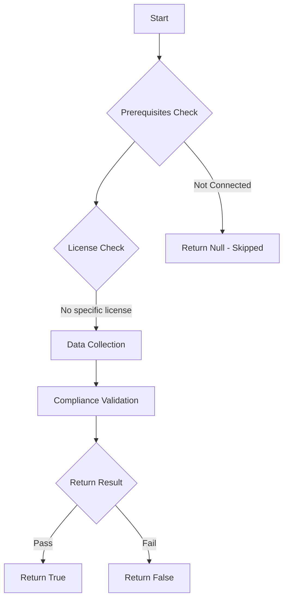

# Test-MtAIAgentDormant: Tests if AI agents are dormant.

## Overview

**Function Name:** `Test-MtAIAgentDormant`
**Category:** Maester/AIAgent

## Description

Checks all published Copilot Studio agents for those that have not been
    modified or republished within 180 days.
    Dormant agents may have outdated configurations, unpatched vulnerabilities,
    or stale permissions that present unnecessary risk.

## Workflow

## Phase Details

### Phase 1: Prerequisites Check

No specific prerequisites required.

### Phase 2: Data Collection

**Cmdlets/Functions Used:**
- `Get-MtAIAgentInfo`

### Phase 3: Compliance Validation

**Properties Checked:**

| Property | Expected Value |
| --- | --- |
| `AgentStatus` | `Published` |
| `LastModifiedTime` | `$threshold` |

### Phase 4: Return Result

| Return Value | Meaning |
| --- | --- |
| `$true` | Compliant |
| `$false` | Non-Compliant |
| `$null` | Skipped (missing prerequisites, license, or error) |

## Original Documentation

AI agents should not remain dormant for extended periods.

Published agents that have not been modified in over 180 days may have outdated configurations, stale permissions, or unpatched security settings. These agents continue to be accessible to users but may no longer reflect current organizational policies.

### How to fix

Review dormant agents and either update their configuration to align with current policies, or unpublish/delete agents that are no longer needed.

Learn more: [Delete agents programmatically](https://learn.microsoft.com/microsoft-copilot-studio/admin-api-delete) and [delete an agent in Copilot Studio](https://learn.microsoft.com/microsoft-copilot-studio/authoring-first-bot#delete-an-agent)

<!--- Results --->
%TestResult%

## Standalone Function

See the standalone compliance check function: [`Test-MtAIAgentDormantCompliance.ps1`](../../standalone-functions/Maester/AIAgent/Test-MtAIAgentDormantCompliance.ps1)
