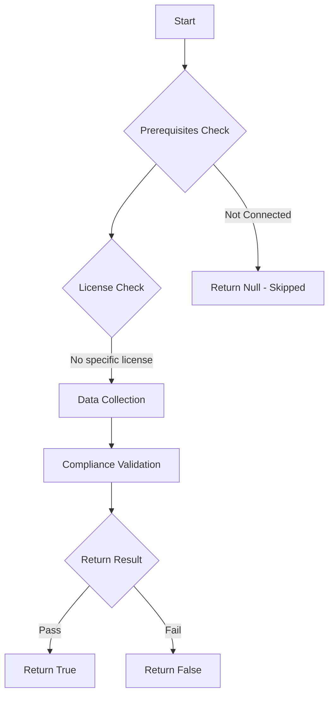

# Test-MtAIAgentEmailExfiltration: Tests if AI agents can send email with AI-controlled inputs.

## Overview

**Function Name:** `Test-MtAIAgentEmailExfiltration`
**Category:** Maester/AIAgent

## Description

Checks all Copilot Studio agents for email-sending tools (such as Office 365
    Outlook or SendMail connectors) where the recipient, subject, or body may be
    controlled by AI-generated content. This presents a risk of data exfiltration
    via email to attacker-controlled addresses.

## Workflow

## Phase Details

### Phase 1: Prerequisites Check

No specific prerequisites required.

### Phase 2: Data Collection

**Cmdlets/Functions Used:**
- `Get-MtAIAgentInfo`

### Phase 3: Compliance Validation

The function validates the collected data against compliance requirements.

### Phase 4: Return Result

| Return Value | Meaning |
| --- | --- |
| `$true` | Compliant |
| `$false` | Non-Compliant |
| `$null` | Skipped (missing prerequisites, license, or error) |

## Original Documentation

AI agents should not send email with AI-controlled inputs.

Agents configured with email-sending tools (such as Office 365 Outlook connectors) where the recipient, subject, or body can be influenced by AI-generated content present a data exfiltration risk. An attacker could craft prompts that cause the agent to send sensitive organizational data to external addresses.

### How to fix

Remove email-sending tools from agents that do not have a legitimate business need to send email. For agents that do require email capabilities, ensure recipients are restricted to a fixed list and are not dynamically determined by user input or AI-generated content. Use DLP policies to block the Outlook connector for agents that should not send email.

Learn more: [Configure data policies for agents](https://learn.microsoft.com/microsoft-copilot-studio/admin-data-loss-prevention?tabs=webapp#configure-a-data-policy-in-the-power-platform-admin-center)

<!--- Results --->
%TestResult%

## Standalone Function

See the standalone compliance check function: [`Test-MtAIAgentEmailExfiltrationCompliance.ps1`](../../standalone-functions/Maester/AIAgent/Test-MtAIAgentEmailExfiltrationCompliance.ps1)
