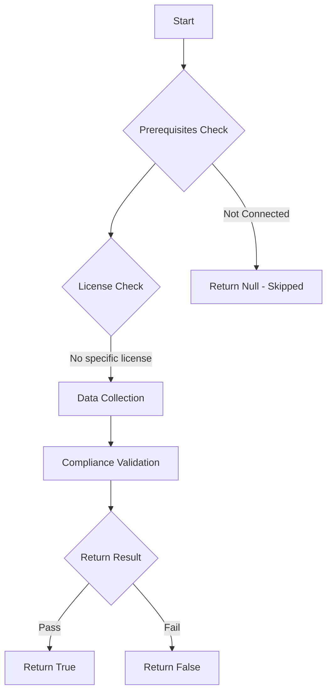

# Test-MtAIAgentHardCodedCredentials: Tests if AI agents have hard-coded credentials in topic definitions.

## Overview

**Function Name:** `Test-MtAIAgentHardCodedCredentials`
**Category:** Maester/AIAgent

## Description

Scans all Copilot Studio agent topics for patterns that suggest hard-coded
    credentials, API keys, connection strings, or secrets. Hard-coded credentials
    in agent topics can be extracted by prompt injection attacks and often persist
    after key rotation is performed elsewhere.

## Workflow

## Phase Details

### Phase 1: Prerequisites Check

No specific prerequisites required.

### Phase 2: Data Collection

**Cmdlets/Functions Used:**
- `Get-MtAIAgentInfo`

### Phase 3: Compliance Validation

The function validates the collected data against compliance requirements.

### Phase 4: Return Result

| Return Value | Meaning |
| --- | --- |
| `$true` | Compliant |
| `$false` | Non-Compliant |
| `$null` | Skipped (missing prerequisites, license, or error) |

## Original Documentation

AI agents should not have hard-coded credentials in topic definitions.

Hard-coded credentials such as API keys, bearer tokens, connection strings, or passwords embedded in agent topics can be extracted through prompt injection attacks. These credentials often persist in agent definitions long after they have been rotated elsewhere, creating a window of exposure.

### How to fix

Replace all hard-coded credentials with secure alternatives. Use Power Platform environment variables for configuration values and Azure Key Vault for secrets. Configure custom connectors with proper OAuth or API key authentication that stores credentials outside the agent topic definition.

Learn more: [Use environment variables in Power Platform](https://learn.microsoft.com/en-us/power-apps/maker/data-platform/environmentvariables)

<!--- Results --->
%TestResult%

## Standalone Function

See the standalone compliance check function: [`Test-MtAIAgentHardCodedCredentialsCompliance.ps1`](../../standalone-functions/Maester/AIAgent/Test-MtAIAgentHardCodedCredentialsCompliance.ps1)
