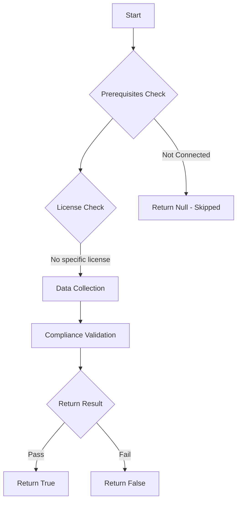

# Test-MtAIAgentMcpTools: Tests if AI agents are configured with MCP server tools.

## Overview

**Function Name:** `Test-MtAIAgentMcpTools`
**Category:** Maester/AIAgent

## Description

Checks all Copilot Studio agents for Model Context Protocol (MCP) server tool
    integrations. MCP tools extend agents with arbitrary external capabilities and
    may introduce supply chain risks if the MCP server is compromised or untrusted.

## Workflow

## Phase Details

### Phase 1: Prerequisites Check

No specific prerequisites required.

### Phase 2: Data Collection

**Cmdlets/Functions Used:**
- `Get-MtAIAgentInfo`

### Phase 3: Compliance Validation

The function validates the collected data against compliance requirements.

### Phase 4: Return Result

| Return Value | Meaning |
| --- | --- |
| `$true` | Compliant |
| `$false` | Non-Compliant |
| `$null` | Skipped (missing prerequisites, license, or error) |

## Original Documentation

AI agents should not use MCP server tools without review.

Model Context Protocol (MCP) tools extend agent capabilities by connecting to external servers. These integrations introduce supply chain risks — if an MCP server is compromised, tools-poisoned or untrusted, it could provide malicious instructions, exfiltrate data, or execute unauthorized actions through the agent.

### How to fix

Review all MCP server integrations in the flagged agents. Ensure each MCP server endpoint is owned by your organization or a trusted partner, is hosted on infrastructure you control, and uses HTTPS with proper authentication. Consider replacing MCP tools with Power Platform custom connectors that provide DLP policy enforcement and governance controls.

Learn more: [Use MCP servers in Copilot Studio](https://learn.microsoft.com/en-us/microsoft-copilot-studio/agent-extend-action-mcp)

<!--- Results --->
%TestResult%

## Standalone Function

See the standalone compliance check function: [`Test-MtAIAgentMcpToolsCompliance.ps1`](../../standalone-functions/Maester/AIAgent/Test-MtAIAgentMcpToolsCompliance.ps1)
