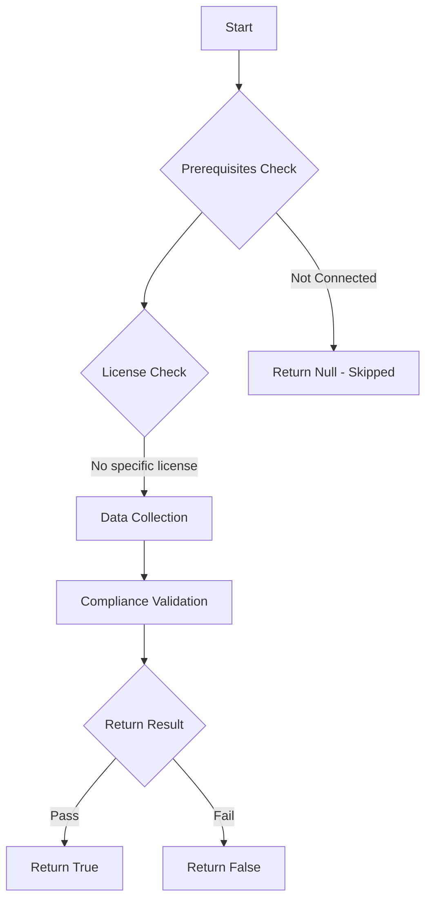

# Test-MtAIAgentMissingInstructions: Tests if AI agents with generative orchestration have custom instructions.

## Overview

**Function Name:** `Test-MtAIAgentMissingInstructions`
**Category:** Maester/AIAgent

## Description

Checks all Copilot Studio agents that use generative orchestration (generative
    actions enabled) for the presence of custom instructions. Agents without
    instructions rely entirely on the LLM's default behavior, which increases the
    risk of prompt injection, off-topic responses, and uncontrolled tool usage.

## Workflow

## Phase Details

### Phase 1: Prerequisites Check

No specific prerequisites required.

### Phase 2: Data Collection

**Cmdlets/Functions Used:**
- `Get-MtAIAgentInfo`

### Phase 3: Compliance Validation

The function validates the collected data against compliance requirements.

### Phase 4: Return Result

| Return Value | Meaning |
| --- | --- |
| `$true` | Compliant |
| `$false` | Non-Compliant |
| `$null` | Skipped (missing prerequisites, license, or error) |

## Original Documentation

AI agents with generative orchestration should have custom instructions.

Agents that use generative orchestration (generative actions enabled) without custom instructions rely entirely on the LLM's default behavior. This increases the risk of prompt injection attacks, off-topic or harmful responses, and uncontrolled tool invocation. Custom instructions act as a system prompt that constrains the agent's behavior.

### How to fix

Open each flagged agent in Copilot Studio and add custom instructions that define the agent's purpose, boundaries, and behavioral constraints. At minimum, instructions should specify what the agent is allowed to do, what topics are off-limits, and how it should handle attempts to override its instructions.

Learn more: [Create and edit custom instructions](https://learn.microsoft.com/en-us/microsoft-copilot-studio/authoring-instructions)

<!--- Results --->
%TestResult%

## Standalone Function

See the standalone compliance check function: [`Test-MtAIAgentMissingInstructionsCompliance.ps1`](../../standalone-functions/Maester/AIAgent/Test-MtAIAgentMissingInstructionsCompliance.ps1)
