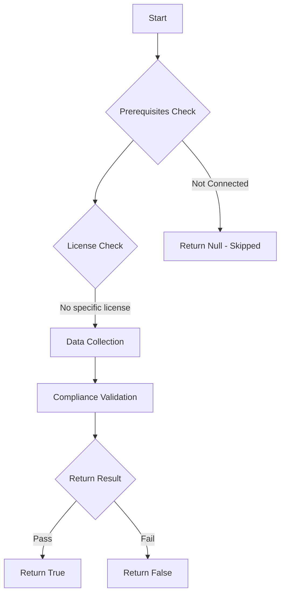

# Test-MtAIAgentNoAuthentication: Tests if AI agents require user authentication.

## Overview

**Function Name:** `Test-MtAIAgentNoAuthentication`
**Category:** Maester/AIAgent

## Description

Checks all Copilot Studio agents for weak or missing authentication.
    Flags agents with no authentication configured, as well as agents where
    authentication is configured but 'Require users to sign in' is not enabled
    (trigger set to 'As Needed' instead of 'Always').

## Workflow

## Phase Details

### Phase 1: Prerequisites Check

No specific prerequisites required.

### Phase 2: Data Collection

**Cmdlets/Functions Used:**
- `Get-MtAIAgentInfo`

### Phase 3: Compliance Validation

**Properties Checked:**

| Property | Expected Value |
| --- | --- |
| `UserAuthenticationType` | `None` |
| `AuthenticationTrigger` | `As` |

### Phase 4: Return Result

| Return Value | Meaning |
| --- | --- |
| `$true` | Compliant |
| `$false` | Non-Compliant |
| `$null` | Skipped (missing prerequisites, license, or error) |

## Original Documentation

AI agents should require user authentication with sign-in enforced.

This test flags two issues:
- **No authentication**: Agents configured without any authentication allow anonymous access.
- **Sign-in not required**: Agents with authentication configured but "Require users to sign in" toggled off. This means users can interact with the agent without authenticating, undermining the auth configuration.

### How to fix

1. In Copilot Studio, open the agent settings and configure authentication to use **Authenticate with Microsoft** or **Authenticate manually**.
2. Enable **Require users to sign in** to ensure every user authenticates before interacting with the agent.

Learn more: [Configure user authentication in Copilot Studio](https://learn.microsoft.com/microsoft-copilot-studio/configuration-end-user-authentication#required-user-sign-in-and-agent-sharing)

<!--- Results --->
%TestResult%

## Standalone Function

See the standalone compliance check function: [`Test-MtAIAgentNoAuthenticationCompliance.ps1`](../../standalone-functions/Maester/AIAgent/Test-MtAIAgentNoAuthenticationCompliance.ps1)
