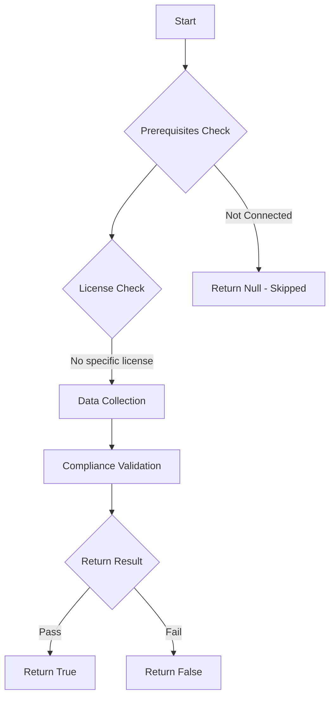

# Test-MtAIAgentOrphaned: Tests if AI agents are orphaned.

## Overview

**Function Name:** `Test-MtAIAgentOrphaned`
**Category:** Maester/AIAgent

## Description

Checks all Copilot Studio agents for those whose owner accounts no longer
    exist or are disabled in Entra ID. Orphaned agents lack active governance
    and may drift from security policies without anyone responsible for
    maintaining them.

## Workflow

## Phase Details

### Phase 1: Prerequisites Check

No specific prerequisites required.

### Phase 2: Data Collection

**Graph API Calls:**
- `users/$upn`

**Cmdlets/Functions Used:**
- `Get-MtAIAgentInfo`
- `Invoke-MtGraphRequest`

### Phase 3: Compliance Validation

The function validates the collected data against compliance requirements.

### Phase 4: Return Result

| Return Value | Meaning |
| --- | --- |
| `$true` | Compliant |
| `$false` | Non-Compliant |
| `$null` | Skipped (missing prerequisites, license, or error) |

## Original Documentation

AI agents should not be orphaned without an active owner.

Agents whose owners have been disabled or deleted in Entra ID lack active governance. No one is responsible for maintaining their configuration, reviewing their security settings, or responding to incidents involving the agent.

### How to fix

Assign an active user as the owner of each orphaned agent in Copilot Studio. If the agent is no longer needed, unpublish or delete it.

Learn more: [Agent Registry in the Microsoft 365 admin center](https://learn.microsoft.com/microsoft-365/admin/manage/agent-registry) and [share agents with other users](https://learn.microsoft.com/microsoft-copilot-studio/admin-share-bots?tabs=web)

<!--- Results --->
%TestResult%

## Standalone Function

See the standalone compliance check function: [`Test-MtAIAgentOrphanedCompliance.ps1`](../../standalone-functions/Maester/AIAgent/Test-MtAIAgentOrphanedCompliance.ps1)
