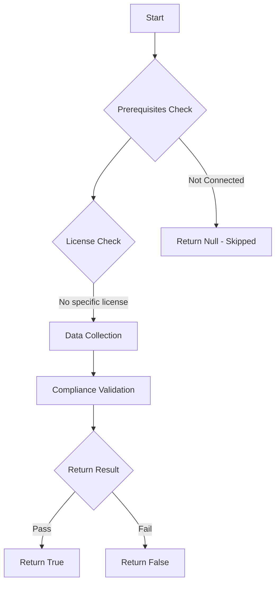

# Test-MtAIAgentRiskyHttpConfig: Tests if AI agents have risky HTTP configurations.

## Overview

**Function Name:** `Test-MtAIAgentRiskyHttpConfig`
**Category:** Maester/AIAgent

## Description

Checks all Copilot Studio agents for HTTP actions that connect to non-standard
    ports or non-connector endpoints. HTTP actions to unexpected destinations may
    indicate data exfiltration, command-and-control communication, or misconfigured
    integrations.

## Workflow

## Phase Details

### Phase 1: Prerequisites Check

No specific prerequisites required.

### Phase 2: Data Collection

**Cmdlets/Functions Used:**
- `Get-MtAIAgentInfo`

### Phase 3: Compliance Validation

The function validates the collected data against compliance requirements.

### Phase 4: Return Result

| Return Value | Meaning |
| --- | --- |
| `$true` | Compliant |
| `$false` | Non-Compliant |
| `$null` | Skipped (missing prerequisites, license, or error) |

## Original Documentation

AI agents should not use risky HTTP configurations.

Agents with HTTP request nodes in topics connecting to non-standard ports or using plain HTTP (instead of HTTPS) may be misconfigured or could indicate data exfiltration or command-and-control communication channels.

### How to fix

Review the HTTP request nodes in each flagged agent's topics. Ensure all HTTP requests use HTTPS on standard port 443. Replace direct HTTP calls with Power Platform connectors where possible, as connectors provide built-in governance and DLP policy enforcement.

Learn more: [Configure data policies for agents](https://learn.microsoft.com/microsoft-copilot-studio/admin-data-loss-prevention?tabs=webapp#block-http-requests)

<!--- Results --->
%TestResult%

## Standalone Function

See the standalone compliance check function: [`Test-MtAIAgentRiskyHttpConfigCompliance.ps1`](../../standalone-functions/Maester/AIAgent/Test-MtAIAgentRiskyHttpConfigCompliance.ps1)
