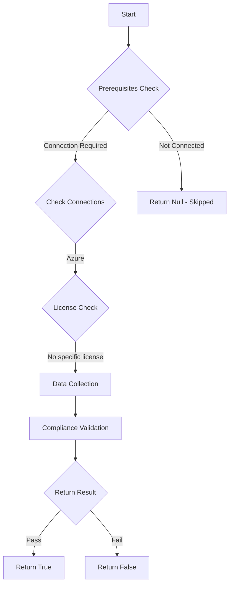

# Azure: Checks if write permissions are required to create new management groups

## Overview

**Function Name:** `Test-MtManagementGroupWriteRequirement`
**Category:** Maester/Azure
**Test Tag:** `Azure`

## Description

This test ensures that only users with explicit write access can create new management groups.
    This is important to prevent unauthorized creation of management groups which could lead to security risks.

## Workflow

## Phase Details

### Phase 1: Prerequisites Check

**Required Connections:**
- Azure

### Phase 2: Data Collection

**Cmdlets/Functions Used:**
- `Get-MtAzureManagementGroup`
- `Invoke-MtAzureRequest`

### Phase 3: Compliance Validation

The function validates the collected data against compliance requirements.

### Phase 4: Return Result

| Return Value | Meaning |
| --- | --- |
| `$true` | Compliant |
| `$false` | Non-Compliant |
| `$null` | Skipped (missing prerequisites, license, or error) |

## Original Documentation

By default, all Entra ID security principals can create new management groups. This introduces governance and security risks, as it allows any user to create a new management group and link subscriptions to it without oversight.

To prevent this, Azure provides a setting that enforces write permission requirements for the creation of new management groups. This ensures that only authorized users can manage the structure of your management group hierarchy.

#### Remediation action:

To enable the requirement for write permissions:
1. Navigate to the Microsoft Azure Portal: [https://portal.azure.com](https://portal.azure.com).
2. In the search bar, type **Management groups** and open the blade.
3. Select **Settings** in the left navigation menu.
4. Under **Permissions for creating new management groups**, enable the switch:
   **Require write permissions for creating new management groups**.

#### Related links

* [Organize your resources with management groups](https://learn.microsoft.com/en-us/azure/governance/management-groups/overview)

<!--- Results --->
%TestResult%

## Standalone Function

See the standalone compliance check function: [`Test-MtManagementGroupWriteRequirementCompliance.ps1`](../../standalone-functions/Maester/Azure/Test-MtManagementGroupWriteRequirementCompliance.ps1)
