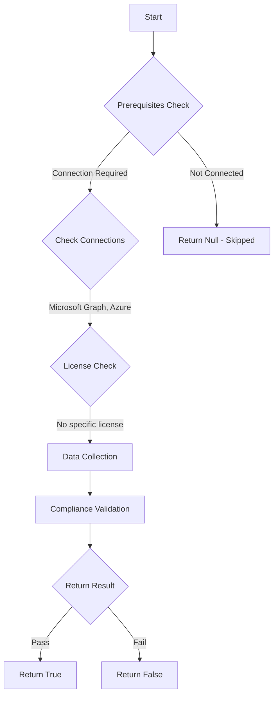

# Test-MtUserAccessAdmin: Checks if any Global Admins have User Access Control permissions at the Root Scope

## Overview

**Function Name:** `Test-MtUserAccessAdmin`
**Category:** Maester/Azure

## Description

Ensure that no one has permanent access to all subscriptions through the Root Scope.

## Workflow



## Phase Details

### Phase 1: Prerequisites Check

**Required Connections:**
- Microsoft Graph
- Azure

### Phase 2: Data Collection

**Cmdlets/Functions Used:**
- `Invoke-MtAzureRequest`
- `Get-ObjectProperty`
- `Get-MtDirectoryObjects`

### Phase 3: Compliance Validation

The function validates the collected data against compliance requirements.

### Phase 4: Return Result

| Return Value | Meaning |
| --- | --- |
| `$true` | Compliant |
| `$false` | Non-Compliant |
| `$null` | Skipped (missing prerequisites, license, or error) |

## Original Documentation

Ensure that no person has permanent access to Azure Subscriptions.

User Access Administrator is a role that allows an Administrator to perform everything on an Azure Subscription. Global Administrators can gain this permission on the Root Scope in Entra ID, in the properties of the Entra ID tenant. These permissions should only be used in case of emergency and should not be assigned permanently.

Ensure that no User Access Administrator permissions at the Root Scope are applied.

#### Remediation action:

To remove all Admins with Root Scope permissions, as a Global Admin:
1. Navigate to Microsoft Azure Portal [https://portal.azure.com](https://portal.azure.com).
2. Search for **Microsoft Entra ID** and select **Microsoft Entra ID**.
3. Expand the **Manage** menu and select **Properties**.
3. On the **Properties** page, go to the **Access management for Azure resources** section.
4. In the information bar, click **Manage elevated access users**.
5. Select all User Access Administrators and click **Remove**.
6. Also check other role assignments, as they need to be removed to pass the tests.

To remove the admins through CLI:
```powershell
az role assignment delete --role "User Access Administrator" --assignee adminname@yourdomain.com --scope "/"
```

#### Related links

* [Manage who can create Microsoft 365 Groups](https://learn.microsoft.com/en-us/microsoft-365/solutions/manage-creation-of-groups?view=o365-worldwide)


<!--- Results --->
%TestResult%

## Standalone Function

See the standalone compliance check function: [`Test-MtUserAccessAdminCompliance.ps1`](../../standalone-functions/Maester/Azure/Test-MtUserAccessAdminCompliance.ps1)
