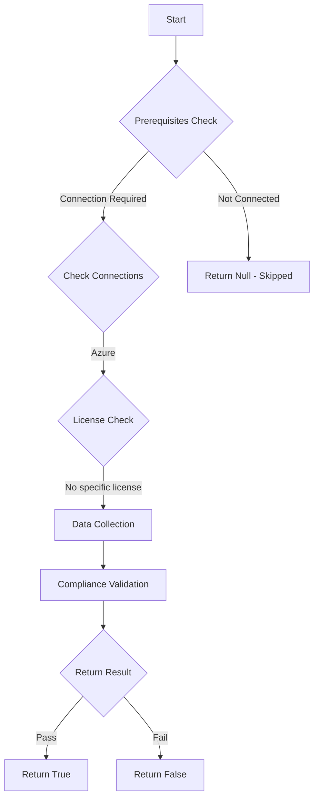

# Backup: Checks if all Recovery Services Vaults have Soft Delete enabled

## Overview

**Function Name:** `Test-MtVaultSoftDelete`
**Category:** Maester/Azure
**Test Tag:** `Backup`

## Description

This test ensures that all Recovery Services Vaults have Soft Delete enabled
    by evaluating the `enhancedSecurityState` property. Soft Delete protects backup
    data from accidental or malicious deletion and is a recommended security control.

## Workflow

## Phase Details

### Phase 1: Prerequisites Check

**Required Connections:**
- Azure

### Phase 2: Data Collection

**Cmdlets/Functions Used:**
- `Invoke-MtAzureResourceGraphRequest`
- `Invoke-MtAzureRequest`

### Phase 3: Compliance Validation

The function validates the collected data against compliance requirements.

### Phase 4: Return Result

| Return Value | Meaning |
| --- | --- |
| `$true` | Compliant |
| `$false` | Non-Compliant |
| `$null` | Skipped (missing prerequisites, license, or error) |

## Original Documentation

Soft delete ensures that backup items and recovery points are retained for a period after deletion. This protects against accidental or malicious deletion of backups.

Ensure that all Recovery Services Vaults across all subscriptions have soft delete enabled.

### Remediation action:

To enable soft delete on a Recovery Services Vault:
1. Go to the Azure portal: https://portal.azure.com
2. Navigate to **Recovery Services Vaults**
3. Select the vault and go to **Properties**
4. Under **Soft Delete**, ensure it is set to **Enabled**

Note: New vaults typically have soft delete enabled by default.

### Related links

* [Soft delete for Recovery Services vaults](https://learn.microsoft.com/en-us/azure/backup/backup-azure-security-feature-cloud)

<!--- Results --->
%TestResult%

## Standalone Function

See the standalone compliance check function: [`Test-MtVaultSoftDeleteCompliance.ps1`](../../standalone-functions/Maester/Azure/Test-MtVaultSoftDeleteCompliance.ps1)
