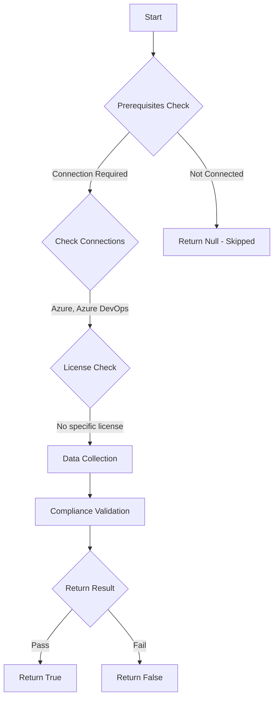

# Test-AzdoAllowExtensionsLocalNetworkAccess: Returns a boolean depending on the configuration.

## Overview

**Function Name:** `Test-AzdoAllowExtensionsLocalNetworkAccess`
**Category:** Maester/AzureDevOps

## Description

Checks if extensions are allowed to access resources on the local network.

    https://learn.microsoft.com/en-us/azure/devops/marketplace/allow-extensions-local-network?view=azure-devops

## Workflow

## Phase Details

### Phase 1: Prerequisites Check

**Required Connections:**
- Azure
- Azure DevOps

### Phase 2: Data Collection

**Cmdlets/Functions Used:**
- `Get-ADOPSOrganizationPolicy`

### Phase 3: Compliance Validation

The function validates the collected data against compliance requirements.

### Phase 4: Return Result

| Return Value | Meaning |
| --- | --- |
| `$true` | Compliant |
| `$false` | Non-Compliant |
| `$null` | Skipped (missing prerequisites, license, or error) |

## Original Documentation

Extensions **should not be** allowed to access resources on the local network.

Rationale: Allowing extensions to make requests to local network resources (loopback addresses like 127.0.0.1 or private IP ranges) increases the risk of server-side request forgery (SSRF) attacks. This policy should be disabled unless your extensions specifically require local network access.

#### Remediation action:
Disable the policy to prevent extensions from accessing local network resources.
1. Sign in to your organization.
2. Choose Organization settings.
3. Select Policies, locate the "Allow extensions to access resources on the local network" policy and toggle it to off.

**Results:**
With the policy disabled, extensions cannot make requests to loopback addresses or private IP address ranges, reducing the risk of SSRF attacks.

#### Related links

* [Learn - Allow extensions to access resources on the local network](https://learn.microsoft.com/en-us/azure/devops/marketplace/allow-extensions-local-network?view=azure-devops)

## Standalone Function

See the standalone compliance check function: [`Test-AzdoAllowExtensionsLocalNetworkAccessCompliance.ps1`](../../standalone-functions/Maester/AzureDevOps/Test-AzdoAllowExtensionsLocalNetworkAccessCompliance.ps1)
