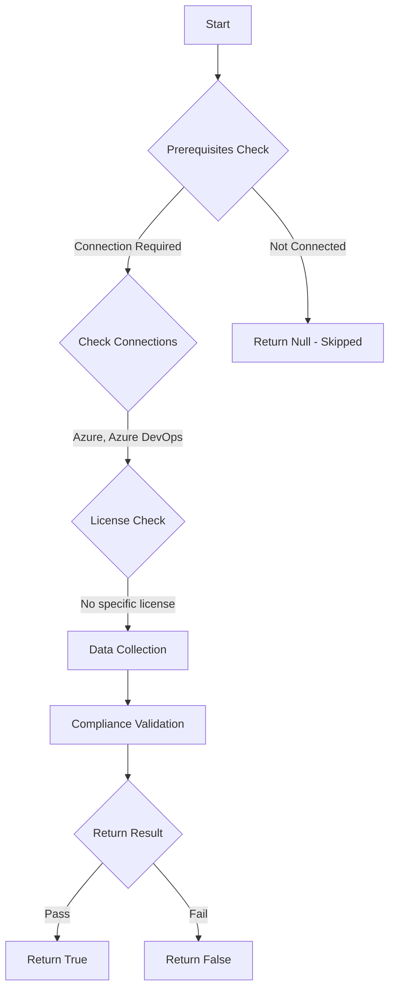

# Test-AzdoAllowRequestAccessToken: Returns a boolean depending on the configuration.

## Overview

**Function Name:** `Test-AzdoAllowRequestAccessToken`
**Category:** Maester/AzureDevOps

## Description

Checks the status of the 'Request Access' policy in Azure DevOps to prevent users from requesting access to your organization or projects.
    When this policy is enabled, users can request access, and administrators receive email notifications for review and approval.
    Disabling the policy stops these requests and notifications, helping you control access more tightly.

    https://go.microsoft.com/fwlink/?linkid=2113172

## Workflow

## Phase Details

### Phase 1: Prerequisites Check

**Required Connections:**
- Azure
- Azure DevOps

### Phase 2: Data Collection

**Cmdlets/Functions Used:**
- `Get-ADOPSOrganizationPolicy`

### Phase 3: Compliance Validation

The function validates the collected data against compliance requirements.

### Phase 4: Return Result

| Return Value | Meaning |
| --- | --- |
| `$true` | Compliant |
| `$false` | Non-Compliant |
| `$null` | Skipped (missing prerequisites, license, or error) |

## Original Documentation

Request access to Azure DevOps by e-mail notifications to administrators **should be** disabled.

Rationale: Access control to Azure DevOps is to be a controlled process where access is granted and tracked.

#### Remediation action:
Disable the policy to stop these requests and notifications.
1. Sign in to your organization.
2. Choose Organization settings.
3. Select Policies, locate the Request Access policy and toggle it to off.
4. Provide the URL to your internal process for gaining access. Users see this URL in the error report when they try to access the organization or a project within the organization that they don't have permission to access.

**Results:**
When users try to access a project without the required permissions, the error message includes the request access URL. This link is shown on the error page to maintain confidentiality, regardless of whether the project exists.

#### Related links

* [Azure DevOps Security - Disable your organization's Request Access policy](https://go.microsoft.com/fwlink/?linkid=2113172)

## Standalone Function

See the standalone compliance check function: [`Test-AzdoAllowRequestAccessTokenCompliance.ps1`](../../standalone-functions/Maester/AzureDevOps/Test-AzdoAllowRequestAccessTokenCompliance.ps1)
