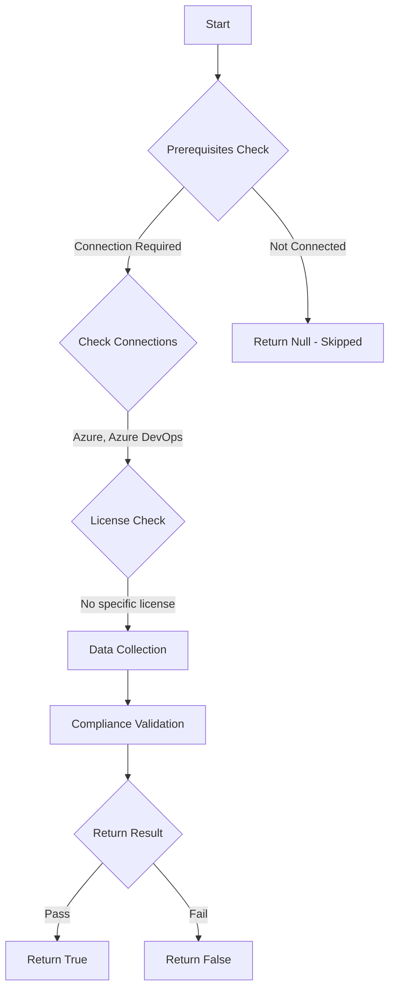

# Test-AzdoAllowTeamAdminsInvitationsAccessToken: Returns a boolean depending on the configuration.

## Overview

**Function Name:** `Test-AzdoAllowTeamAdminsInvitationsAccessToken`
**Category:** Maester/AzureDevOps

## Description

By default, all administrators can invite new users to their Azure DevOps organization.
    Disabling this policy prevents Team and Project Administrators from inviting new users or adding Entra groups.
    However, Project Collection Administrators (PCAs) can still add new users and Entra groups to the organization regardless of the policy status.
    Additionally, if a user is already a member of the organization, Project and Team Administrators can add that user to specific projects.

    https://aka.ms/azure-devops-invitations-policy

## Workflow

## Phase Details

### Phase 1: Prerequisites Check

**Required Connections:**
- Azure
- Azure DevOps

### Phase 2: Data Collection

**Cmdlets/Functions Used:**
- `Get-ADOPSOrganizationPolicy`

### Phase 3: Compliance Validation

The function validates the collected data against compliance requirements.

### Phase 4: Return Result

| Return Value | Meaning |
| --- | --- |
| `$true` | Compliant |
| `$false` | Non-Compliant |
| `$null` | Skipped (missing prerequisites, license, or error) |

## Original Documentation

Access to Azure DevOps **should be** a controlled process managed by the IAM team or the appropriate Azure DevOps administrator roles.

Rationale: By default, all administrators can invite new users to their Azure DevOps organization. Disabling this policy prevents Team and Project Administrators from inviting new users.
Project Collection Administrators (PCAs) can still add new users to the organization regardless of the policy status. Additionally, if a user is already a member of the organization, Project and Team Administrators can add that user to specific projects.

#### Remediation action:
Disable the policy to stop these invitations.
1. Sign in to your organization.
2. Choose Organization settings.
3. Select Policies, locate the **Allow team and project administrators to invite new users** policy and toggle it to off.
4. Now, only Project Collection Administrators can invite new users to Azure DevOps.

> Project and Team Administrators can directly add users to their projects through the permissions blade. However, if they attempt to add users through the Add Users button located in the Organization settings > Users section, it's not visible to them. Adding a user directly through Project settings > Permissions doesn't result in the user appearing automatically in the Organization settings > Users list. For the user to be reflected in the Users list, they must sign in to the system.

#### Related links

* [Azure DevOps Security - Restrict administrators from inviting new users](https://aka.ms/azure-devops-invitations-policy)

## Standalone Function

See the standalone compliance check function: [`Test-AzdoAllowTeamAdminsInvitationsAccessTokenCompliance.ps1`](../../standalone-functions/Maester/AzureDevOps/Test-AzdoAllowTeamAdminsInvitationsAccessTokenCompliance.ps1)
