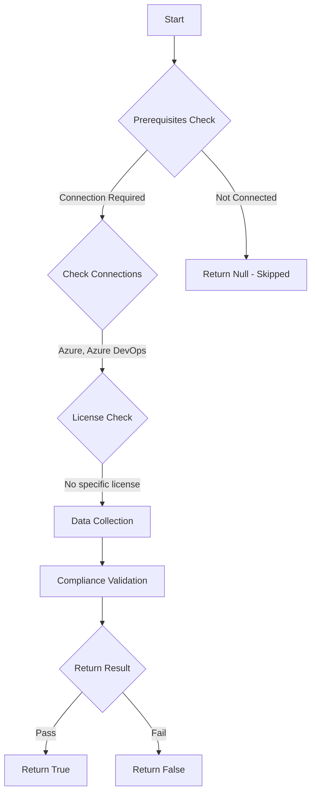

# Test-AzdoArtifactsExternalPackageProtectionToken: Returns a boolean depending on the configuration.

## Overview

**Function Name:** `Test-AzdoArtifactsExternalPackageProtectionToken`
**Category:** Maester/AzureDevOps

## Description

Checks the policy for additional security for your private feeds by limiting access to externally sourced packages when internally sourced packages are already present.
    This provides a new layer of security, which prevents malicious packages from a public registry being inadvertently consumed.
    These changes will not affect any package versions that are already in use or cached in your feed.

    https://devblogs.microsoft.com/devops/changes-to-azure-artifact-upstream-behavior

## Workflow

## Phase Details

### Phase 1: Prerequisites Check

**Required Connections:**
- Azure
- Azure DevOps

### Phase 2: Data Collection

**Cmdlets/Functions Used:**
- `Get-ADOPSOrganizationPolicy`

### Phase 3: Compliance Validation

The function validates the collected data against compliance requirements.

### Phase 4: Return Result

| Return Value | Meaning |
| --- | --- |
| `$true` | Compliant |
| `$false` | Non-Compliant |
| `$null` | Skipped (missing prerequisites, license, or error) |

## Original Documentation

Externally sourced package versions **should be** manually approved for internal use to prevent malicious packages from a public registry being inadvertently consumed.

Rationale: Previously, Azure Artifacts feeds presented package versions from all of its upstream sources. This includes package versions that were originally pushed to an Azure Artifacts feed (internally sourced) and package versions from common public repositories like npmjs.com, NuGet.org, Maven Central, and PyPI (externally sourced).

Configure a policy for additional security for your private feeds by limiting access to externally sourced packages when internally sourced packages are already present. This change provides a new layer of protection and prevents malicious packages from a public registry being inadvertently consumed. It does not affect any package versions that are already in use or cached in your feed.

#### Remediation action:

Enable the policy to opt-in for additional protective behavior.

1. Sign in to your organization.
2. Choose Organization settings.
3. Select policies under the security section
4. In the security policies section, toggle on ‘Additional protections when using public package registries’

**Results:**
The security behavior applies:
when an internally sourced version is already in your feed, or
when consuming a package from your feed for the first time (i.e. it is not yet in your feed), and at least one of the versions available from an upstream is internally sourced.
With the new behavior, any versions from the public registry will be blocked and not made available to download. You are able to configure the upstream behavior to allow externally sourced package versions if you choose to.

#### Related links

* [Microsoft Devblogs - Changes to Azure Artifacts Upstream Behavior](https://devblogs.microsoft.com/devops/changes-to-azure-artifact-upstream-behavior/)

## Standalone Function

See the standalone compliance check function: [`Test-AzdoArtifactsExternalPackageProtectionTokenCompliance.ps1`](../../standalone-functions/Maester/AzureDevOps/Test-AzdoArtifactsExternalPackageProtectionTokenCompliance.ps1)
