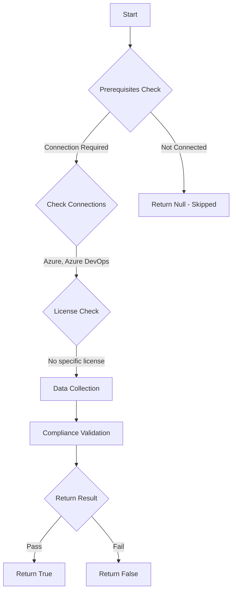

# Test-AzdoAuditStream: Returns a boolean depending on the configuration.

## Overview

**Function Name:** `Test-AzdoAuditStream`
**Category:** Maester/AzureDevOps

## Description

Sends auditing data to Security Incident and Event Management (SIEM) tools and opens new possibilities,
    such as the ability to trigger alerts for specific events, create views on auditing data, and perform
    anomaly detection. Setting up a stream also allows you to store more than 90-days of auditing data,
    which is the maximum amount of data that Azure DevOps keeps for your organizations.

    https://learn.microsoft.com/en-us/azure/devops/organizations/audit/auditing-streaming?view=azure-devops

## Workflow

## Phase Details

### Phase 1: Prerequisites Check

**Required Connections:**
- Azure
- Azure DevOps

### Phase 2: Data Collection

**Cmdlets/Functions Used:**
- `Get-ADOPSAuditStreams`

### Phase 3: Compliance Validation

The function validates the collected data against compliance requirements.

### Phase 4: Return Result

| Return Value | Meaning |
| --- | --- |
| `$true` | Compliant |
| `$false` | Non-Compliant |
| `$null` | Skipped (missing prerequisites, license, or error) |

## Original Documentation

Audit logs **should be** retained according to your organization's needs and protected from purging.

Rationale: Send auditing data to other Security Incident and Event Management (SIEM) tools and open new possibilities, such as the ability to trigger alerts for specific events, create views on auditing data, and perform anomaly detection. Setting up a stream also allows you to store more than 90-days of auditing data, which is the maximum amount of data that Azure DevOps keeps for your organizations.

#### Remediation action:

Create an audit stream, which sends data to other locations for further processing.

1. Sign in to your organization.
2. Choose Organization settings.
3. Select Auditing.
> If you don't see Auditing in Organization Settings, then auditing is not currently enabled for your organization. Someone in the organization owner or Project Collection Administrators (PCAs) group must enable Auditing in Organization Policies. You will then be able to see events on the Auditing page if you have the appropriate permissions.
1. Go to the Streams tab, and then select New stream.
2. Select the stream target that you want to configure, and then select from the following instructions to set up your stream target type.
   1. Splunk
   2. Event Grid
   3. Azure Monitor Log

**Results:**
Audit streams represent a pipeline that flows audit events from your Azure DevOps organization to a stream target. At least every half hour, new audit events are bundled and streamed to your targets. 

#### Related links

* [Azure DevOps Security - Create audit streaming](https://learn.microsoft.com/en-us/azure/devops/organizations/audit/auditing-streaming?view=azure-devops)

## Standalone Function

See the standalone compliance check function: [`Test-AzdoAuditStreamCompliance.ps1`](../../standalone-functions/Maester/AzureDevOps/Test-AzdoAuditStreamCompliance.ps1)
