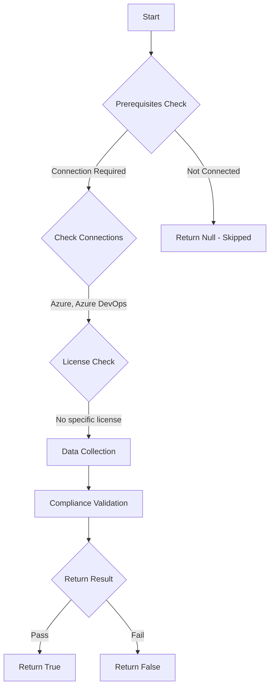

# Test-AzdoDisableGlobalPATCreation: Returns a boolean depending on the configuration.

## Overview

**Function Name:** `Test-AzdoDisableGlobalPATCreation`
**Category:** Maester/AzureDevOps

## Description

Checks if global Personal Access Token creation is restricted.

    Requires Azure DevOps organization backed by a Microsoft Entra tenant and
    Azure DevOps Administrator permissions.

    https://learn.microsoft.com/en-us/azure/devops/organizations/accounts/manage-pats-with-policies-for-administrators?view=azure-devops#restrict-creation-of-global-pats-tenant-policy

## Workflow

## Phase Details

### Phase 1: Prerequisites Check

**Required Connections:**
- Azure
- Azure DevOps

### Phase 2: Data Collection

**Cmdlets/Functions Used:**
- `Get-ADOPSTenantPolicy`

### Phase 3: Compliance Validation

The function validates the collected data against compliance requirements.

### Phase 4: Return Result

| Return Value | Meaning |
| --- | --- |
| `$true` | Compliant |
| `$false` | Non-Compliant |
| `$null` | Skipped (missing prerequisites, license, or error) |

## Original Documentation

Restrict creation of global Personal Access Tokens (PATs) **should be** enabled.

#### Prerequisites

- Your organization must be linked to a Microsoft Entra tenant.
- You must be an Azure DevOps Administrator to configure tenant policies.

#### Rationale

Global PATs can be used across all accessible organizations. Restricting their creation ensures tokens are confined to a single org, enforcing least privilege and reducing cross-org exposure risk.

#### Remediation action

Enable the tenant policy to stop creation of global PATs.
1. Sign in to your organization (https://dev.azure.com/{Your_Organization}).
2. Select Organization settings (gear icon).
3. Select Microsoft Entra, locate the "Restrict global personal access token creation" policy.
4. Move the toggle to On.

#### Allowlist and exceptions

- Add Microsoft Entra users or groups to the allowlist to exempt them from the restriction.
- Prefer groups over individual users to avoid identity residency problems.

**Existing PATs:**

Existing global PATs remain valid until they expire; the policy affects only newly created tokens.

**Results:**

When enabled, new PATs must be associated with a single Azure DevOps organization. Users not on the allowlist cannot create global tokens.

#### Related links
* [Learn - Restrict creation of global PATs (tenant policy)](https://learn.microsoft.com/en-us/azure/devops/organizations/accounts/manage-pats-with-policies-for-administrators?view=azure-devops#restrict-creation-of-global-pats-tenant-policy)

## Standalone Function

See the standalone compliance check function: [`Test-AzdoDisableGlobalPATCreationCompliance.ps1`](../../standalone-functions/Maester/AzureDevOps/Test-AzdoDisableGlobalPATCreationCompliance.ps1)
