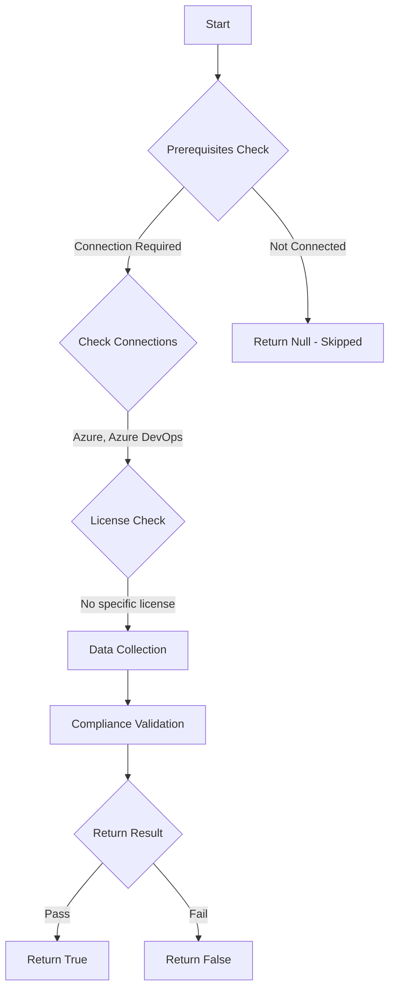

# Test-AzdoDisablePATCreation: Returns a boolean depending on the configuration.

## Overview

**Function Name:** `Test-AzdoDisablePATCreation`
**Category:** Maester/AzureDevOps

## Description

Checks if Personal Access Token creation is restricted at the organization level.

    https://learn.microsoft.com/en-us/azure/devops/organizations/accounts/manage-pats-with-policies-for-administrators?view=azure-devops

## Workflow

## Phase Details

### Phase 1: Prerequisites Check

**Required Connections:**
- Azure
- Azure DevOps

### Phase 2: Data Collection

**Cmdlets/Functions Used:**
- `Get-ADOPSOrganizationPolicy`

### Phase 3: Compliance Validation

The function validates the collected data against compliance requirements.

### Phase 4: Return Result

| Return Value | Meaning |
| --- | --- |
| `$true` | Compliant |
| `$false` | Non-Compliant |
| `$null` | Skipped (missing prerequisites, license, or error) |

## Original Documentation

Personal Access Token creation **should be** restricted at the organization level.

Rationale: Restricting PAT creation reduces the risk of long-lived credentials being used to access your Azure DevOps organization. Existing personal access tokens remain valid until expiration when the policy is enabled.

#### Remediation action:
Enable the policy to restrict Personal Access Token creation.
1. Sign in to your organization.
2. Choose Organization settings.
3. Select Policies, locate the "Restrict personal access token (PAT) creation" policy and toggle it to on.

**Results:**
With the policy enabled, users cannot create new Personal Access Tokens unless explicitly allowed through the allow list.

#### Related links

* [Learn - Manage PATs with policies for administrators](https://learn.microsoft.com/en-us/azure/devops/organizations/accounts/manage-pats-with-policies-for-administrators?view=azure-devops)

## Standalone Function

See the standalone compliance check function: [`Test-AzdoDisablePATCreationCompliance.ps1`](../../standalone-functions/Maester/AzureDevOps/Test-AzdoDisablePATCreationCompliance.ps1)
