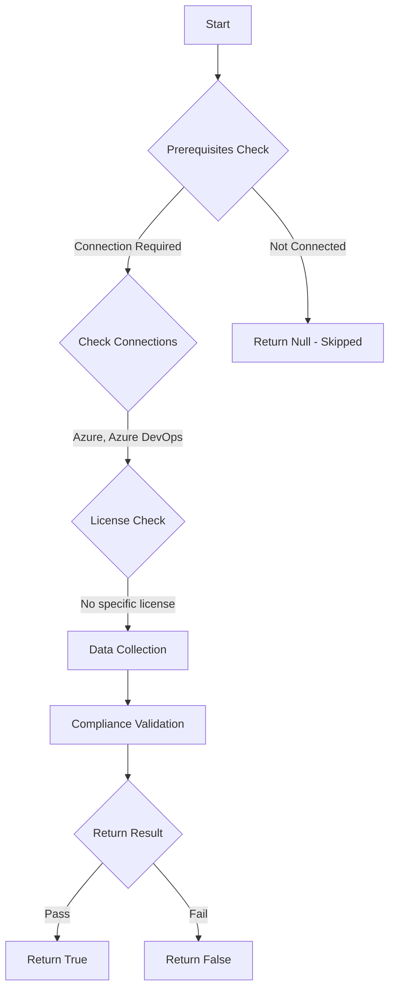

# Test-AzdoEnableLeakedPersonalAccessTokenAutoRevocation: Returns a boolean depending on the configuration.

## Overview

**Function Name:** `Test-AzdoEnableLeakedPersonalAccessTokenAutoRevocation`
**Category:** Maester/AzureDevOps

## Description

Checks if leaked Personal Access Token auto-revocation is enabled.

    Requires Azure DevOps organization backed by a Microsoft Entra tenant and
    Azure DevOps Administrator permissions.

    https://learn.microsoft.com/en-us/azure/devops/organizations/accounts/manage-pats-with-policies-for-administrators?view=azure-devops#automatic-revocation-of-leaked-tokens

## Workflow

## Phase Details

### Phase 1: Prerequisites Check

**Required Connections:**
- Azure
- Azure DevOps

### Phase 2: Data Collection

**Cmdlets/Functions Used:**
- `Get-ADOPSTenantPolicy`

### Phase 3: Compliance Validation

The function validates the collected data against compliance requirements.

### Phase 4: Return Result

| Return Value | Meaning |
| --- | --- |
| `$true` | Compliant |
| `$false` | Non-Compliant |
| `$null` | Skipped (missing prerequisites, license, or error) |

## Original Documentation

Automatic revocation of leaked Personal Access Tokens **should be** enabled.

#### Prerequisites

- Your organization must be linked to a Microsoft Entra tenant.
- You must be an Azure DevOps Administrator to configure tenant policies.

#### Rationale

Automatically revoking PATs detected as leaked minimizes the window of opportunity for unauthorized access. Disabling this policy leaves exposed tokens active even if they appear in public repositories.

#### Remediation action

Enable the tenant policy to revoke leaked tokens.
1. Sign in to your organization (https://dev.azure.com/{yourorganization}).
2. Select Organization settings (gear icon).
3. Select Microsoft Entra, locate the "Automatically revoke leaked personal access tokens" policy.
4. Move the toggle to On.

**Results:**

When enabled, Azure DevOps will automatically revoke any PATs detected as leaked or exposed. If the policy is later disabled, tokens checked into public GitHub repositories remain active.

#### Related links
* [Learn - Automatic revocation of leaked tokens](https://learn.microsoft.com/en-us/azure/devops/organizations/accounts/manage-pats-with-policies-for-administrators?view=azure-devops#automatic-revocation-of-leaked-tokens)

## Standalone Function

See the standalone compliance check function: [`Test-AzdoEnableLeakedPersonalAccessTokenAutoRevocationCompliance.ps1`](../../standalone-functions/Maester/AzureDevOps/Test-AzdoEnableLeakedPersonalAccessTokenAutoRevocationCompliance.ps1)
