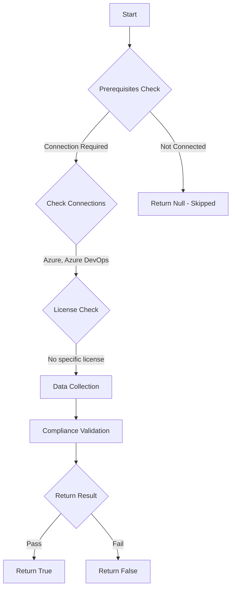

# Test-AzdoEnforceAADConditionalAccess: Returns a boolean depending on the configuration.

## Overview

**Function Name:** `Test-AzdoEnforceAADConditionalAccess`
**Category:** Maester/AzureDevOps

## Description

Checks the status of when you sign in to the web portal of a Microsoft Entra ID-backed organization,
    Microsoft Entra ID always performs validation for any Conditional Access Policies (CAPs) set by tenant administrators.

    https://learn.microsoft.com/en-us/azure/devops/organizations/accounts/manage-conditional-access?view=azure-devops&tabs=preview-page

## Workflow

## Phase Details

### Phase 1: Prerequisites Check

**Required Connections:**
- Azure
- Azure DevOps

### Phase 2: Data Collection

**Cmdlets/Functions Used:**
- `Get-ADOPSOrganizationPolicy`

### Phase 3: Compliance Validation

The function validates the collected data against compliance requirements.

### Phase 4: Return Result

| Return Value | Meaning |
| --- | --- |
| `$true` | Compliant |
| `$false` | Non-Compliant |
| `$null` | Skipped (missing prerequisites, license, or error) |

## Original Documentation

Conditional Access Policies **should be** configured for Microsoft Entra ID-backed organizations.

Rationale: When you sign in to the web portal of a Microsoft Entra ID-backed organization, Microsoft Entra ID always performs validation for any Conditional Access Policies (CAPs) set by tenant administrators.

#### Remediation action:
Enable or configure the appropriate Conditional Access policy in Microsoft Entra to enforce sign-in requirements for your Azure DevOps organization.
1. Sign in to your organization.
2. Choose Organization settings.
3. Select Policies, and then toggle your policy to on or off as needed.
   1. If the “Enable IP Conditional Access policy Validation” organization policy is enabled, we check IP fencing policies on both web and non-interactive flows, such as non-Microsoft client flows (e.g., using a PAT with git operations).
   2. Sign-in policies might be enforced for PATs as well. Using PATs to make Microsoft Entra ID calls requires adherence to any sign-in policies that are set. For example, if a sign-in policy requires that a user sign in every seven days, you must also sign in every seven days to continue using PATs for Microsoft Entra ID requests.
> We support MFA policies on web flows only. For non-interactive flows, if they don't satisfy the conditional access policy, the user isn't prompted for MFA and gets blocked instead.
> We support IP-fencing conditional access policies (CAPs) for both IPv4 and IPv6 addresses. If your IPv6 address is being blocked, ensure that the tenant administrator configured CAPs to allow your IPv6 address. Additionally, consider including the IPv4-mapped address for any default IPv6 address in all CAP conditions.

**Results:**
When you sign in to the web portal of a Microsoft Entra ID-backed organization, Microsoft Entra ID always performs validation for any Conditional Access Policies (CAPs) set by tenant administrators.

#### Related links

* [Azure DevOps Security - Conditional Access Policies support on Azure DevOps](https://learn.microsoft.com/en-us/azure/devops/organizations/accounts/change-application-access-policies?view=azure-devops#cap-support-on-azure-devops)

## Standalone Function

See the standalone compliance check function: [`Test-AzdoEnforceAADConditionalAccessCompliance.ps1`](../../standalone-functions/Maester/AzureDevOps/Test-AzdoEnforceAADConditionalAccessCompliance.ps1)
