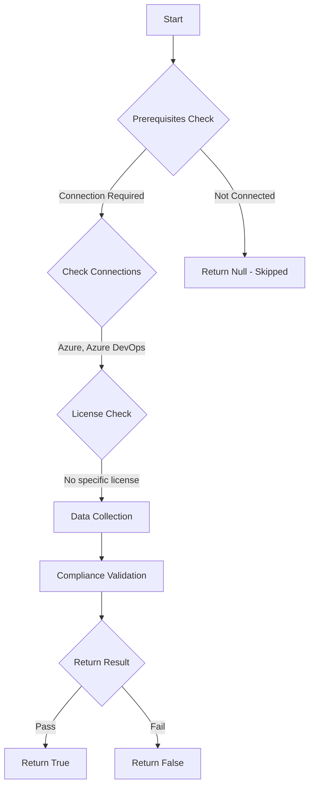

# Test-AzdoExternalGuestAccess: Returns a boolean depending on the configuration.

## Overview

**Function Name:** `Test-AzdoExternalGuestAccess`
**Category:** Maester/AzureDevOps

## Description

Checks the configuration of external guest access to Azure DevOps.

    https://learn.microsoft.com/en-us/azure/devops/organizations/security/security-overview?view=azure-devops#manage-external-guest-access

## Workflow

## Phase Details

### Phase 1: Prerequisites Check

**Required Connections:**
- Azure
- Azure DevOps

### Phase 2: Data Collection

**Cmdlets/Functions Used:**
- `Get-ADOPSOrganizationPolicy`

### Phase 3: Compliance Validation

The function validates the collected data against compliance requirements.

### Phase 4: Return Result

| Return Value | Meaning |
| --- | --- |
| `$true` | Compliant |
| `$false` | Non-Compliant |
| `$null` | Skipped (missing prerequisites, license, or error) |

## Original Documentation

External guest access to Azure DevOps **should be** a controlled process.

Rationale: External guest access can introduce potential security risks if not managed properly.

#### Remediation action:
Disable the "External guest access" policy to prevent external guest access if there's no business need for it.
1. Sign in to your organization.
2. Choose Organization settings.
3. Select Policies, locate the External guest access policy and toggle it to off.

#### Related links

* [Azure DevOps Security - Manage external guest access](https://learn.microsoft.com/en-us/azure/devops/organizations/security/security-overview?view=azure-devops#manage-external-guest-access)

## Standalone Function

See the standalone compliance check function: [`Test-AzdoExternalGuestAccessCompliance.ps1`](../../standalone-functions/Maester/AzureDevOps/Test-AzdoExternalGuestAccessCompliance.ps1)
