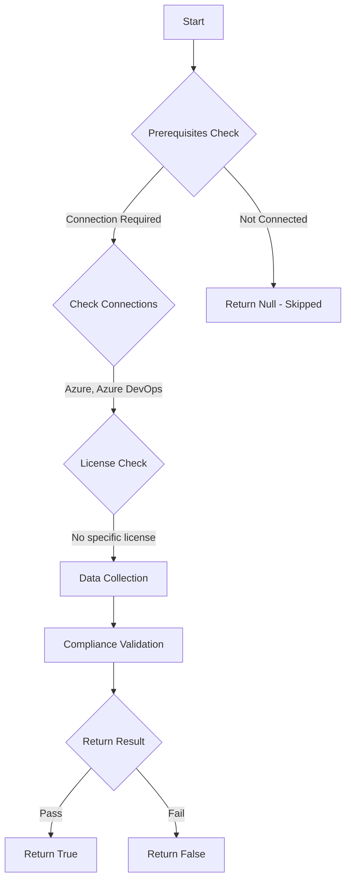

# Test-AzdoFeedbackCollection: Returns a boolean depending on the configuration.

## Overview

**Function Name:** `Test-AzdoFeedbackCollection`
**Category:** Maester/AzureDevOps

## Description

Checks the status if Azure DevOps is collecting customer feedback to the product team.

    https://aka.ms/ADOPrivacyPolicy
    https://learn.microsoft.com/en-us/azure/devops/organizations/security/data-protection?view=azure-devops#managing-privacy-policies-for-admins-to-control-user-feedback-collection

## Workflow

## Phase Details

### Phase 1: Prerequisites Check

**Required Connections:**
- Azure
- Azure DevOps

### Phase 2: Data Collection

**Cmdlets/Functions Used:**
- `Get-ADOPSOrganizationPolicy`

### Phase 3: Compliance Validation

The function validates the collected data against compliance requirements.

### Phase 4: Return Result

| Return Value | Meaning |
| --- | --- |
| `$true` | Compliant |
| `$false` | Non-Compliant |
| `$null` | Skipped (missing prerequisites, license, or error) |

## Original Documentation

Providing or collecting customer feedback to the product team for Azure DevOps **should be** enabled.

Rationale: You should have confidence that Microsoft is handling your data appropriately and for legitimate uses. Part of that assurance involves carefully restricting usage.

#### Remediation action:
Enable the policy to allow Microsoft to collect feedback.
1. Sign in to your organization.
2. Choose Organization settings.
3. Select Policies, locate the "Allow Microsoft to collect feedback from users" policy and toggle it to on.

#### Related links

* [Azure DevOps Privacy Policy](https://aka.ms/ADOPrivacyPolicy)
* [Manage Privacy policies for admins to control user feedback collection](https://learn.microsoft.com/en-us/azure/devops/organizations/security/data-protection?view=azure-devops#managing-privacy-policies-for-admins-to-control-user-feedback-collection)

## Standalone Function

See the standalone compliance check function: [`Test-AzdoFeedbackCollectionCompliance.ps1`](../../standalone-functions/Maester/AzureDevOps/Test-AzdoFeedbackCollectionCompliance.ps1)
