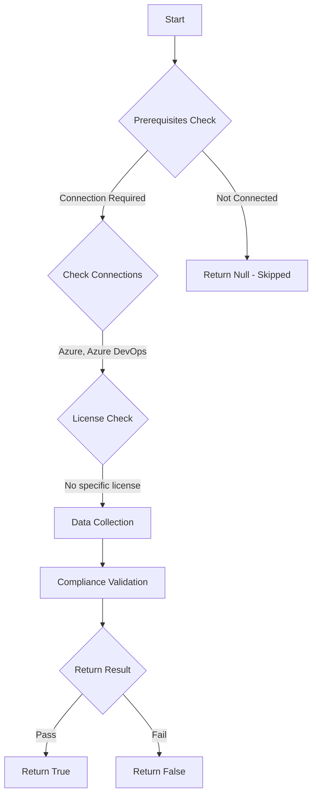

# Test-AzdoLogAuditEvent: Returns a boolean depending on the configuration.

## Overview

**Function Name:** `Test-AzdoLogAuditEvent`
**Category:** Maester/AzureDevOps

## Description

Checks if auditing of events is configured.

    https://learn.microsoft.com/en-us/azure/devops/organizations/audit/azure-devops-auditing?view=azure-devops&tabs=preview-page#enable-and-disable-auditing
    https://learn.microsoft.com/en-us/azure/devops/organizations/audit/azure-devops-auditing?view=azure-devops&tabs=preview-page#review-audit-log

## Workflow

## Phase Details

### Phase 1: Prerequisites Check

**Required Connections:**
- Azure
- Azure DevOps

### Phase 2: Data Collection

**Cmdlets/Functions Used:**
- `Get-ADOPSOrganizationPolicy`

### Phase 3: Compliance Validation

The function validates the collected data against compliance requirements.

### Phase 4: Return Result

| Return Value | Meaning |
| --- | --- |
| `$true` | Compliant |
| `$false` | Non-Compliant |
| `$null` | Skipped (missing prerequisites, license, or error) |

## Original Documentation

Auditing **should be** enabled.

Rationale: Keeping track of activities within your Azure DevOps environment is crucial for security and compliance. Auditing helps you monitor and log these activities, providing transparency and accountability.

#### Remediation action:
Enable the policy to stop these requests and notifications.
1. Sign in to your organization.
2. Choose Organization settings.
3. Select Policies under the Security header.
4. Switch the Log Audit Events button to ON.

**Results:**
Auditing is enabled for the organization. Refresh the page to see Auditing appear in the sidebar. Audit events start appearing in Auditing Logs and through any configured audit streams.

#### Related links

* [Learn - Enable and disable auditing](https://learn.microsoft.com/en-us/azure/devops/organizations/audit/azure-devops-auditing?view=azure-devops&tabs=preview-page#enable-and-disable-auditing)
* [Learn - Review audit log](https://learn.microsoft.com/en-us/azure/devops/organizations/audit/azure-devops-auditing?view=azure-devops&tabs=preview-page#review-audit-log)

## Standalone Function

See the standalone compliance check function: [`Test-AzdoLogAuditEventCompliance.ps1`](../../standalone-functions/Maester/AzureDevOps/Test-AzdoLogAuditEventCompliance.ps1)
