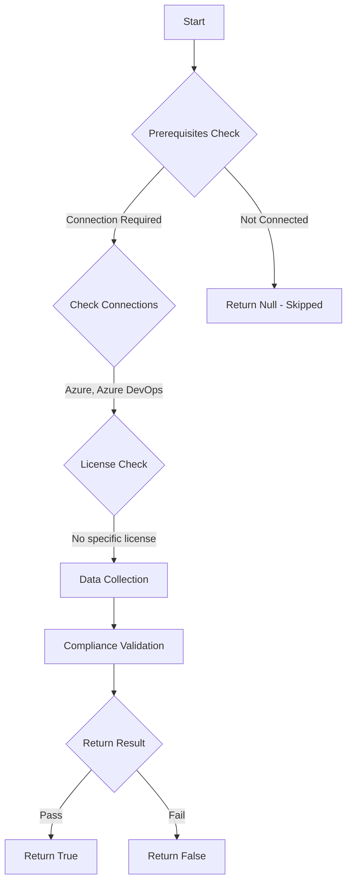

# Test-AzdoOrganizationAutomaticEnrollmentAdvancedSecurityNewProject: Returns a boolean depending on the configuration.

## Overview

**Function Name:** `Test-AzdoOrganizationAutomaticEnrollmentAdvancedSecurityNewProject`
**Category:** Maester/AzureDevOps

## Description

Checks if GitHub advanced Security for Azure DevOps is automatically enabled for new projects.

    https://learn.microsoft.com/en-us/azure/devops/repos/security/configure-github-advanced-security-features?view=azure-devops&tabs=yaml#organization-level-onboarding

## Workflow

## Phase Details

### Phase 1: Prerequisites Check

**Required Connections:**
- Azure
- Azure DevOps

### Phase 2: Data Collection

### Phase 3: Compliance Validation

The function validates the collected data against compliance requirements.

### Phase 4: Return Result

| Return Value | Meaning |
| --- | --- |
| `$true` | Compliant |
| `$false` | Non-Compliant |
| `$null` | Skipped (missing prerequisites, license, or error) |

## Original Documentation

GitHub advanced Security for Azure DevOps **should be** automatically enabled for new projects.

Rationale: Newly created projects should have Advanced Security enabled upon creation.

#### Remediation action:
Organization-level onboarding
1. Sign in to your organization.
2. Go to your Organization settings for your Azure DevOps organization.
3. Select Repositories.
4. Select Enable all and see an estimate for the number of active committers for your organization appear.
5. Select Begin billing to activate Advanced Security for every existing repository in each project in your organization.
6. Select Automatically enable Advanced Security for new repositories so that any newly created projects have Advanced Security enabled upon creation.

**Results:**
Newly created projects have Advanced Security enabled upon creation.

#### Related links

* [Learn - GitHub Advanced Security for Azure DevOps](https://learn.microsoft.com/en-us/azure/devops/repos/security/configure-github-advanced-security-features?view=azure-devops&tabs=yaml#organization-level-onboarding)

## Standalone Function

See the standalone compliance check function: [`Test-AzdoOrganizationAutomaticEnrollmentAdvancedSecurityNewProjectCompliance.ps1`](../../standalone-functions/Maester/AzureDevOps/Test-AzdoOrganizationAutomaticEnrollmentAdvancedSecurityNewProjectCompliance.ps1)
