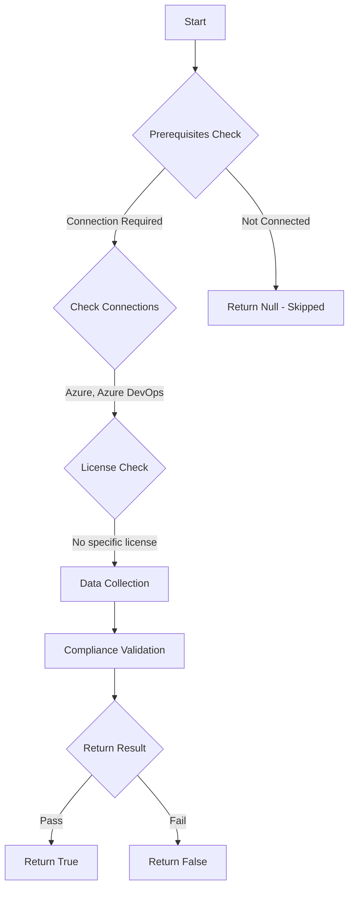

# Test-AzdoOrganizationBadgesArePrivate: Returns a boolean depending on the configuration.

## Overview

**Function Name:** `Test-AzdoOrganizationBadgesArePrivate`
**Category:** Maester/AzureDevOps

## Description

Checks the status of anonymous status badges in Azure DevOps.

    https://learn.microsoft.com/en-us/azure/devops/pipelines/create-first-pipeline?view=azure-devops&tabs=net%2Cbrowser#add-a-status-badge-to-your-repository

## Workflow

## Phase Details

### Phase 1: Prerequisites Check

**Required Connections:**
- Azure
- Azure DevOps

### Phase 2: Data Collection

**Cmdlets/Functions Used:**
- `Get-ADOPSOrganizationPipelineSettings`

### Phase 3: Compliance Validation

The function validates the collected data against compliance requirements.

### Phase 4: Return Result

| Return Value | Meaning |
| --- | --- |
| `$true` | Compliant |
| `$false` | Non-Compliant |
| `$null` | Skipped (missing prerequisites, license, or error) |

## Original Documentation

Status badges in Azure DevOps **should be** disabled.

Rationale: Even in a private project, anonymous badge access is enabled by default. With anonymous badge access enabled, users outside your organization might be able to query information such as project names, branch names, job names, and build status through the badge status API.

#### Remediation action:
Enable the restriction to prevent anonymous access to status badges.
1. Sign in to your organization.
2. Choose Organization settings.
3. Select Settings under Pipelines.
4. Enable the policy "Disable anonymous access to badges"

**Results:**
Users outside of your organization cannot query information regarding your project names, branch names, job names, and build statuses through the badge status API.

#### Related links

* [Learn - Status badges](https://learn.microsoft.com/en-us/azure/devops/pipelines/create-first-pipeline?view=azure-devops&tabs=net%2Cbrowser#add-a-status-badge-to-your-repository)

## Standalone Function

See the standalone compliance check function: [`Test-AzdoOrganizationBadgesArePrivateCompliance.ps1`](../../standalone-functions/Maester/AzureDevOps/Test-AzdoOrganizationBadgesArePrivateCompliance.ps1)
