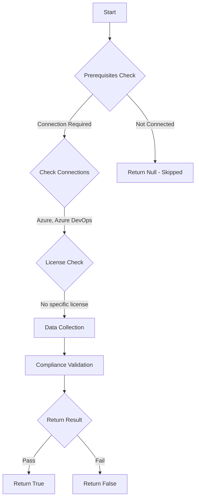

# Test-AzdoOrganizationCreationClassicBuildPipeline: Returns a boolean depending on the configuration.

## Overview

**Function Name:** `Test-AzdoOrganizationCreationClassicBuildPipeline`
**Category:** Maester/AzureDevOps

## Description

Checks if classic build pipelines can be created.

    https://devblogs.microsoft.com/devops/disable-creation-of-classic-pipelines

## Workflow

## Phase Details

### Phase 1: Prerequisites Check

**Required Connections:**
- Azure
- Azure DevOps

### Phase 2: Data Collection

**Cmdlets/Functions Used:**
- `Get-ADOPSOrganizationPipelineSettings`

### Phase 3: Compliance Validation

The function validates the collected data against compliance requirements.

### Phase 4: Return Result

| Return Value | Meaning |
| --- | --- |
| `$true` | Compliant |
| `$false` | Non-Compliant |
| `$null` | Skipped (missing prerequisites, license, or error) |

## Original Documentation

Creating classic build pipelines **should be** disabled.

Rationale: YAML pipelines offer the best security for your Azure Pipelines. In contrast to classic build and release pipelines.

#### Remediation action:
Enable the policy to disable creation of classic build pipelines.
1. Sign in to your organization.
2. Choose Organization settings.
3. Under the Pipelines section choose Settings.
4. In the General section, toggle on Disable creation of classic build pipelines.

**Results:**
*How the feature works*
If you turned on the toggle to Disable creation of classic build and classic release pipelines, then no classic build pipeline, classic release pipeline, task groups, and deployment groups can be created.

The user interface will not show the Releases, Task groups, and Deployment groups left-side menu items if you have none of them.

*Existing classic pipelines*
If you have classic build pipelines, classic release pipelines, task groups, or deployment groups, you’ll still be able to edit and run them. The Pipelines left-side menu will continue to show the corresponding menu items. However, the buttons to create new ones will be disabled.

#### Related links

* [Devblog - Disable creation of classic pipelines](https://devblogs.microsoft.com/devops/disable-creation-of-classic-pipelines/)

## Standalone Function

See the standalone compliance check function: [`Test-AzdoOrganizationCreationClassicBuildPipelineCompliance.ps1`](../../standalone-functions/Maester/AzureDevOps/Test-AzdoOrganizationCreationClassicBuildPipelineCompliance.ps1)
