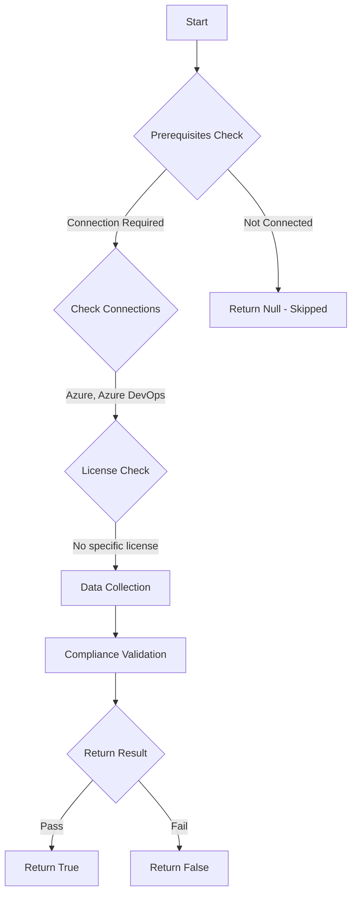

# Test-AzdoOrganizationCreationRestriction: Returns a boolean depending on the configuration.

## Overview

**Function Name:** `Test-AzdoOrganizationCreationRestriction`
**Category:** Maester/AzureDevOps

## Description

Checks if organization creation is restricted.

    Requires Azure DevOps organization backed by a Microsoft Entra tenant and
    Azure DevOps Administrator permissions.

    https://learn.microsoft.com/en-us/azure/devops/organizations/accounts/azure-ad-tenant-policy-restrict-org-creation?view=azure-devops#turn-on-the-policy

## Workflow

## Phase Details

### Phase 1: Prerequisites Check

**Required Connections:**
- Azure
- Azure DevOps

### Phase 2: Data Collection

**Cmdlets/Functions Used:**
- `Get-ADOPSTenantPolicy`

### Phase 3: Compliance Validation

The function validates the collected data against compliance requirements.

### Phase 4: Return Result

| Return Value | Meaning |
| --- | --- |
| `$true` | Compliant |
| `$false` | Non-Compliant |
| `$null` | Skipped (missing prerequisites, license, or error) |

## Original Documentation

Restrict creation of new Azure DevOps organizations **should be** enabled.

#### Prerequisites

- You must have the Azure DevOps Administrator role in your Microsoft Entra tenant.

#### Rationale

Limiting who can create organizations helps maintain governance, control, and compliance across an enterprise Azure DevOps environment.

#### Remediation action

Enable the tenant policy to restrict organization creation.
1. Sign in to your organization (https://dev.azure.com/{Your_Organization}).
2. Select Organization settings (gear icon).
3. Select Microsoft Entra ID, and move the toggle to On to restrict organization creation.

#### Allowlist and exceptions

- After enabling the policy, add Microsoft Entra users or groups to the allowlist to permit them to create organizations.
- Use groups for allowlists to avoid identity residency concerns.

**Results:**

When enabled, only users on the allowlist (or Azure DevOps Administrators as permitted) can create new organizations.

#### Related links
* [Learn - Restrict organization creation](https://learn.microsoft.com/en-us/azure/devops/organizations/accounts/azure-ad-tenant-policy-restrict-org-creation?view=azure-devops#turn-on-the-policy)

## Standalone Function

See the standalone compliance check function: [`Test-AzdoOrganizationCreationRestrictionCompliance.ps1`](../../standalone-functions/Maester/AzureDevOps/Test-AzdoOrganizationCreationRestrictionCompliance.ps1)
