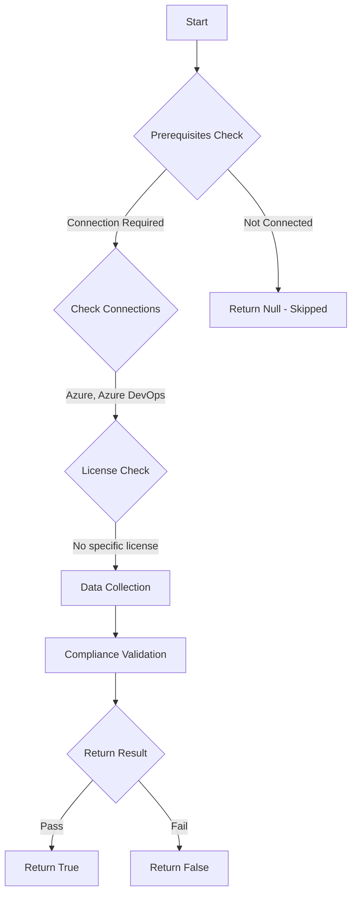

# Test-AzdoOrganizationLimitJobAuthorizationScopeReleasePipeline: Returns a boolean depending on the configuration.

## Overview

**Function Name:** `Test-AzdoOrganizationLimitJobAuthorizationScopeReleasePipeline`
**Category:** Maester/AzureDevOps

## Description

Checks if release pipelines have restricted access to only those repositories that are in the same project as the pipeline.

    https://learn.microsoft.com/en-us/azure/devops/pipelines/process/access-tokens?view=azure-devops&tabs=yaml#job-authorization-scope

## Workflow

## Phase Details

### Phase 1: Prerequisites Check

**Required Connections:**
- Azure
- Azure DevOps

### Phase 2: Data Collection

**Cmdlets/Functions Used:**
- `Get-ADOPSOrganizationPipelineSettings`

### Phase 3: Compliance Validation

The function validates the collected data against compliance requirements.

### Phase 4: Return Result

| Return Value | Meaning |
| --- | --- |
| `$true` | Compliant |
| `$false` | Non-Compliant |
| `$null` | Skipped (missing prerequisites, license, or error) |

## Original Documentation

Release pipelines should have restricted access to only those repositories that are in the same project as the pipeline.

Rationale: If the scope is not restricted at either the organization level or project level, then every job in your release pipeline gets a collection scoped job access token. In other words, your pipeline has access to any repository in any project of your organization. If an adversary is able to gain access to a single pipeline in a single project, they will be able to gain access to any repository in your organization. This is why it is recommended that you restrict the scope at the highest level (organization settings) in order to contain the attack to a single project.

#### Remediation action:
Enable the policy to restrict the job authorization scope.
1. Sign in to your organization.
2. Choose Organization settings.
3. Under the Pipelines section choose Settings.
4. In the General section, toggle on "Limit job authorization scope to current project for release pipelines".

#### Related links

* [Learn - Job Authorization Scope](https://learn.microsoft.com/en-us/azure/devops/pipelines/process/access-tokens?view=azure-devops&tabs=yaml#job-authorization-scope)

## Standalone Function

See the standalone compliance check function: [`Test-AzdoOrganizationLimitJobAuthorizationScopeReleasePipelineCompliance.ps1`](../../standalone-functions/Maester/AzureDevOps/Test-AzdoOrganizationLimitJobAuthorizationScopeReleasePipelineCompliance.ps1)
