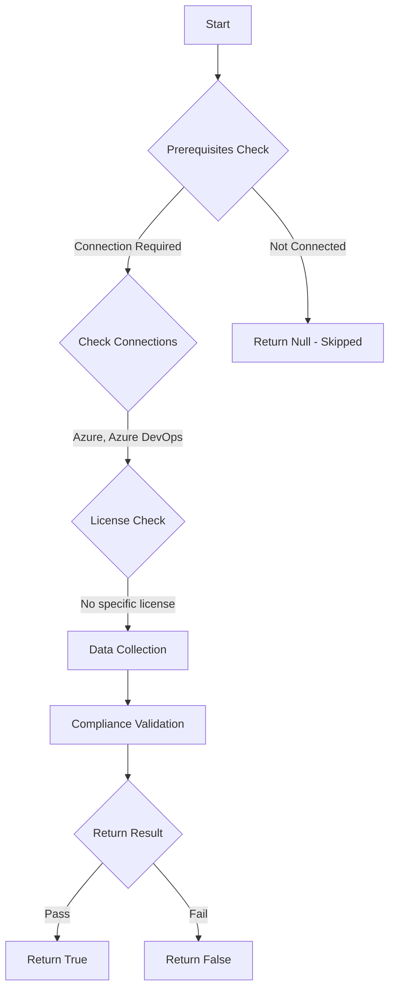

# Test-AzdoOrganizationLimitVariablesAtQueueTime: Returns a boolean depending on the configuration.

## Overview

**Function Name:** `Test-AzdoOrganizationLimitVariablesAtQueueTime`
**Category:** Maester/AzureDevOps

## Description

Checks if user defined variables are able to override system variables or variables not defined by the pipeline author.

    https://learn.microsoft.com/en-us/azure/devops/pipelines/security/inputs?view=azure-devops#limit-variables-that-can-be-set-at-queue-time

## Workflow

## Phase Details

### Phase 1: Prerequisites Check

**Required Connections:**
- Azure
- Azure DevOps

### Phase 2: Data Collection

**Cmdlets/Functions Used:**
- `Get-ADOPSOrganizationPipelineSettings`

### Phase 3: Compliance Validation

The function validates the collected data against compliance requirements.

### Phase 4: Return Result

| Return Value | Meaning |
| --- | --- |
| `$true` | Compliant |
| `$false` | Non-Compliant |
| `$null` | Skipped (missing prerequisites, license, or error) |

## Original Documentation

User-defined variables should not be able to override system variables or variables not defined by the pipeline author.

Rationale: Only those variables explicitly marked as "Settable at queue time" can be set by user.

#### Remediation action:
Enable the policy to limit variables that can be set at queue time.
1. Sign in to your organization.
2. Choose Organization settings.
3. Under the Pipelines section choose Settings.
4. In the General section, toggle on "Limit variables that can be set at queue time".

**Results:**
Only those variables explicitly marked as "Settable at queue time" can be set at queue time.

#### Related links

* [Learn - Secure use of variables in a pipeline](https://learn.microsoft.com/en-us/azure/devops/pipelines/security/inputs?view=azure-devops#limit-variables-that-can-be-set-at-queue-time)

## Standalone Function

See the standalone compliance check function: [`Test-AzdoOrganizationLimitVariablesAtQueueTimeCompliance.ps1`](../../standalone-functions/Maester/AzureDevOps/Test-AzdoOrganizationLimitVariablesAtQueueTimeCompliance.ps1)
