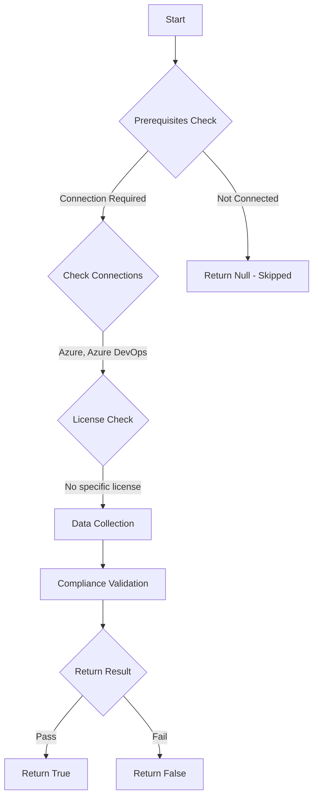

# Test-AzdoOrganizationOwner: Returns a boolean depending on the configuration.

## Overview

**Function Name:** `Test-AzdoOrganizationOwner`
**Category:** Maester/AzureDevOps

## Description

Checks if the Azure DevOps Organization owner is a individual or a service/admin account.
    Returns a true boolean if the users matches adm|admin|btg|svc|service.

    https://learn.microsoft.com/en-us/azure/devops/organizations/accounts/change-organization-ownership?view=azure-devops

## Workflow

## Phase Details

### Phase 1: Prerequisites Check

**Required Connections:**
- Azure
- Azure DevOps

### Phase 2: Data Collection

**Cmdlets/Functions Used:**
- `Get-ADOPSOrganizationAdminOverview`

### Phase 3: Compliance Validation

The function validates the collected data against compliance requirements.

### Phase 4: Return Result

| Return Value | Meaning |
| --- | --- |
| `$true` | Compliant |
| `$false` | Non-Compliant |
| `$null` | Skipped (missing prerequisites, license, or error) |

## Original Documentation

Azure DevOps organization owner **should not** be assigned to a regular user.

Rationale: Owner has full administrative control over the organization, including the ability to manage users, projects, and settings. They can also configure security policies, access levels, and billing information. Ensure that the owner is aware of their responsibilities and has the necessary permissions to effectively manage the organization.

> This query will check if the owner has any of the following words as part of their name to conclude that it is not a regular user: (adm|admin|btg|svc|service)

#### Remediation action:
Ensure that the owner is not a regular user.
1. Sign in to your organization.
2. Choose Organization settings.
3. Select Overview > Change owner.
4. Select an identity from the dropdown menu, or search for an identity by entering the identity's name, and then select Change.

#### Related links

* [Learn - Change the organization owner](https://learn.microsoft.com/en-us/azure/devops/organizations/accounts/change-organization-ownership?view=azure-devops)

## Standalone Function

See the standalone compliance check function: [`Test-AzdoOrganizationOwnerCompliance.ps1`](../../standalone-functions/Maester/AzureDevOps/Test-AzdoOrganizationOwnerCompliance.ps1)
